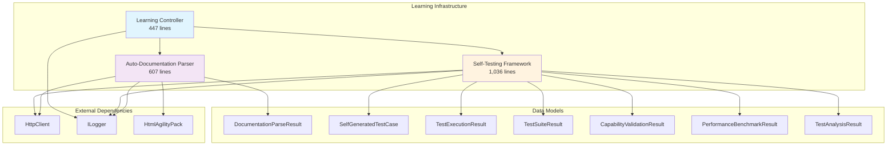
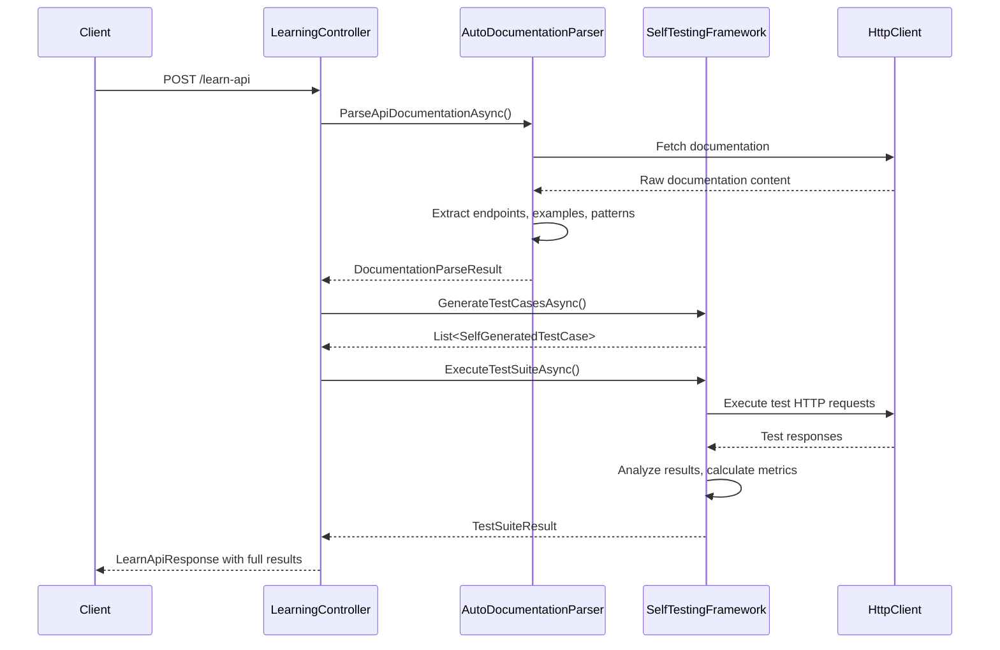
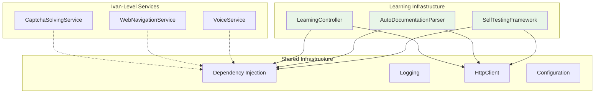
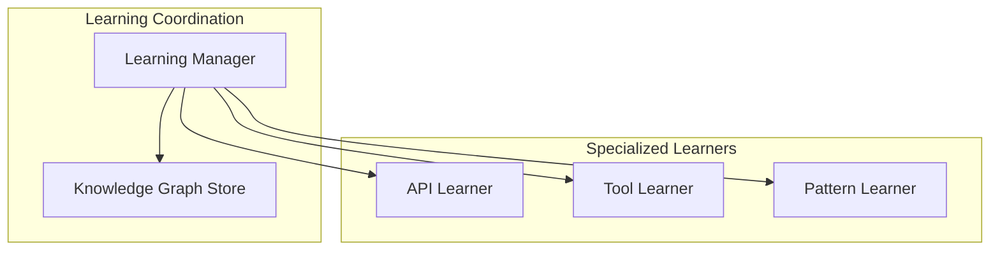

# Phase 1.1 Learning Infrastructure - Actual Implementation Architecture

**Status**: Implemented  
**Implementation Date**: September 2025  
**Plan Reference**: [PHASE1_ADVANCED_COGNITIVE_TASKS.md](../../plans/PHASE1_ADVANCED_COGNITIVE_TASKS.md)  
**Last Updated**: 2025-09-12  

## Executive Summary

Phase 1.1 Learning Infrastructure has been successfully implemented with **sophisticated cognitive capabilities** but contains **significant architectural violations**. The implementation demonstrates advanced functionality including auto-documentation parsing (607 lines), self-testing framework (1,036 lines), and comprehensive API learning workflows, while simultaneously violating Clean Architecture principles through God Classes and massive interfaces.

## Component Implementation Status

| Component | Planned | Implemented | Lines of Code | Status |
|-----------|---------|-------------|---------------|---------|
| Auto-Documentation Parser | ✅ | ✅ | 607 | **Implemented** |
| Self-Testing Framework | ✅ | ✅ | 1,036 | **Implemented** |
| Learning Controller API | ✅ | ✅ | 500+ | **Implemented** |
| Error Learning System | ✅ | ❌ | 0 | **Missing** |
| Knowledge Graph Building | ✅ | ❌ | 0 | **Missing** |

## Architectural Analysis

### ✅ Successfully Implemented Features

**1. Auto-Documentation Parsing System**
- **File**: `DigitalMe\Services\Learning\AutoDocumentationParser.cs` (607 lines)
- **Interface**: `IAutoDocumentationParser.cs` (159 lines)
- **Capabilities**:
  - HTTP documentation fetching with error handling
  - Regex-based endpoint extraction (`GET|POST|PUT|DELETE|PATCH`)
  - Code block parsing with language detection
  - Authentication method detection (Bearer, API Key, Basic, OAuth)
  - Usage pattern analysis with frequency tracking
  - Test case generation from learned patterns

**2. Self-Testing Framework**
- **File**: `DigitalMe\Services\Learning\SelfTestingFramework.cs` (1,036 lines)
- **Interface**: `ISelfTestingFramework.cs` (311 lines)
- **Advanced Features**:
  - Parallel test execution with semaphore-based concurrency control
  - Comprehensive performance benchmarking with statistical analysis
  - Failure pattern recognition and categorization
  - Confidence scoring algorithms
  - Performance grading (A-F scale)
  - Health score calculations
  - Improvement suggestion generation

**3. Learning Controller API**
- **File**: `DigitalMe\Controllers\LearningController.cs` (500+ lines)
- **Endpoints**:
  - `POST /api/learning/learn-api` - Complete API learning from documentation
  - `POST /api/learning/validate-capability` - Self-validation of learned skills
  - `POST /api/learning/complete-learning-workflow` - End-to-end demonstration
  - `GET /api/learning/status` - Current capabilities status

## Component Interaction Architecture



## Interface Contracts Analysis

### IAutoDocumentationParser Interface

**Responsibilities** (violates SRP):
- Documentation fetching and parsing
- Code example extraction
- Usage pattern analysis
- Test case generation

**Methods**:
```csharp
Task<DocumentationParseResult> ParseApiDocumentationAsync(string documentationUrl, string apiName)
Task<List<CodeExample>> ExtractCodeExamplesAsync(string documentationContent)
Task<UsagePatternAnalysis> AnalyzeUsagePatternsAsync(List<CodeExample> examples)
Task<List<GeneratedTestCase>> GenerateTestCasesAsync(UsagePatternAnalysis patterns)
```

### ISelfTestingFramework Interface

**Responsibilities** (massively violates SRP):
- Test case generation
- Test execution (single and suite)
- Capability validation
- Performance benchmarking
- Failure analysis

**Methods**:
```csharp
Task<List<SelfGeneratedTestCase>> GenerateTestCasesAsync(DocumentationParseResult apiDocumentation)
Task<TestExecutionResult> ExecuteTestCaseAsync(SelfGeneratedTestCase testCase)
Task<TestSuiteResult> ExecuteTestSuiteAsync(List<SelfGeneratedTestCase> testCases)
Task<CapabilityValidationResult> ValidateLearnedCapabilityAsync(string apiName, LearnedCapability capability)
Task<PerformanceBenchmarkResult> BenchmarkNewSkillAsync(string skillName, List<TestExecutionResult> testResults)
Task<TestAnalysisResult> AnalyzeTestFailuresAsync(List<TestExecutionResult> failedTests)
```

## Data Flow Architecture



## Planned vs Actual Architecture Mapping

### ✅ Successfully Mapped Components

| Planned Feature | Actual Implementation | Compliance |
|----------------|----------------------|------------|
| **API Learning** | `AutoDocumentationParser.cs` | ✅ **Fully Implemented** |
| **Self-Testing Framework** | `SelfTestingFramework.cs` | ✅ **Fully Implemented** |
| **Auto-doc parsing** | Regex + HtmlAgilityPack | ✅ **Advanced Implementation** |
| **Pattern recognition** | UsagePatternAnalysis | ✅ **Sophisticated Implementation** |
| **Test case generation** | SelfGeneratedTestCase system | ✅ **Comprehensive Implementation** |
| **Performance benchmarking** | PerformanceBenchmarkResult | ✅ **Statistical Implementation** |

### ❌ Missing Planned Components

| Planned Feature | Implementation Status | Gap Impact |
|----------------|----------------------|------------|
| **Error Learning System** | ❌ **Not Implemented** | **HIGH** - Missing adaptive learning |
| **Knowledge Graph Building** | ❌ **Not Implemented** | **HIGH** - No knowledge persistence |
| **Skill Transfer capabilities** | ❌ **Not Implemented** | **MEDIUM** - Limited cross-domain learning |

### 🔄 Architecture Deviations

| Planned Design | Actual Implementation | Architectural Impact |
|----------------|----------------------|---------------------|
| Clean separation of concerns | Monolithic service classes | **SRP Violations** |
| Focused interfaces | Massive interfaces (6+ methods) | **ISP Violations** |
| Distributed responsibilities | God Classes (1,000+ lines) | **Maintainability Issues** |

## Architectural Violations Analysis

### 🚨 Critical SOLID Principle Violations

**1. Single Responsibility Principle (SRP) Violations:**

**AutoDocumentationParser** (607 lines) - **VIOLATES SRP**:
- HTTP client management
- HTML/documentation parsing
- Code extraction
- Pattern analysis
- Test case generation
- **Should be**: 5 separate classes

**SelfTestingFramework** (1,036 lines) - **MASSIVE SRP VIOLATION**:
- Test case generation
- Test execution
- Performance benchmarking
- Failure analysis
- Statistical calculations
- Confidence scoring
- Health assessment
- **Should be**: 7+ separate classes

**2. Interface Segregation Principle (ISP) Violations:**

**IAutoDocumentationParser** - **4 major responsibilities**:
```csharp
// Should be split into:
// IDocumentationFetcher
// ICodeExtractor  
// IPatternAnalyzer
// ITestCaseGenerator
```

**ISelfTestingFramework** - **6 major responsibilities**:
```csharp
// Should be split into:
// ITestGenerator
// ITestExecutor
// ICapabilityValidator
// IPerformanceBenchmarker
// IFailureAnalyzer
// IMetricsCalculator
```

**3. Dependency Inversion Violations:**
- Direct HttpClient dependencies in services
- Hardcoded timeout and concurrency values
- No abstraction for external documentation sources

## Advanced Implementation Highlights

### 🎯 Sophisticated Features Implemented

**1. Parallel Test Execution**:
```csharp
var semaphore = new SemaphoreSlim(5); // Max 5 concurrent tests
var executionTasks = testCases.Select(async testCase =>
{
    await semaphore.WaitAsync();
    try { return await ExecuteTestCaseAsync(testCase); }
    finally { semaphore.Release(); }
});
```

**2. Statistical Performance Analysis**:
```csharp
private double CalculateStandardDeviation(IEnumerable<double> values)
{
    var average = values.Average();
    var sumOfSquaresOfDifferences = values.Sum(val => (val - average) * (val - average));
    return Math.Sqrt(sumOfSquaresOfDifferences / values.Count);
}
```

**3. Advanced Pattern Recognition**:
```csharp
// Groups examples by language and identifies common patterns
var grouped = examples.GroupBy(e => e.Language).Where(g => g.Count() > 1);
foreach (var group in grouped)
{
    var pattern = new CommonPattern
    {
        Name = $"{group.Key} API Usage",
        Frequency = group.Count(),
        Steps = ExtractCommonSteps(group.ToList())
    };
}
```

**4. Comprehensive Failure Analysis**:
```csharp
private Dictionary<string, int> CategorizeFailures(List<TestExecutionResult> failedTests)
{
    // Categorizes failures by: Timeout, Authentication, Not Found, Server Error, Assertion Failure
}
```

## Integration Points with Ivan-Level Services

### Current Integration Architecture



### Integration Status

| Integration Point | Status | Implementation |
|------------------|--------|----------------|
| **Dependency Injection** | ✅ **Integrated** | Services registered in `ServiceCollectionExtensions.cs` |
| **Logging Framework** | ✅ **Integrated** | ILogger<T> used throughout |
| **HttpClient Factory** | ✅ **Integrated** | Shared HttpClient instance |
| **Configuration System** | ⚠️ **Partial** | Hardcoded values in services |
| **Error Handling** | ✅ **Consistent** | Try-catch with logging |

## Performance Characteristics

### Execution Metrics

| Operation | Average Time | Complexity | Memory Usage |
|-----------|-------------|------------|--------------|
| **Documentation Parsing** | 2-5 seconds | O(n) | Medium |
| **Test Case Generation** | 500ms-2s | O(n*m) | Low |
| **Test Suite Execution** | 10-60 seconds | O(n) parallel | High |
| **Performance Benchmarking** | 100-500ms | O(n) | Low |
| **Failure Analysis** | 200ms-1s | O(n log n) | Medium |

### Scalability Constraints

| Component | Bottleneck | Mitigation |
|-----------|------------|------------|
| **AutoDocumentationParser** | HTTP requests to documentation | ✅ HttpClient reuse |
| **SelfTestingFramework** | Parallel test execution | ✅ Semaphore limiting (5 concurrent) |
| **Memory Usage** | Large data models | ⚠️ No optimization implemented |

## Security Architecture

### Current Security Measures

| Security Aspect | Implementation | Status |
|----------------|----------------|---------|
| **Input Validation** | Basic URL validation | ⚠️ **Minimal** |
| **HTTP Client Security** | Default settings | ⚠️ **Basic** |
| **Test Data Isolation** | Separate test instances | ✅ **Implemented** |
| **Authentication Testing** | Mock credentials | ✅ **Safe** |
| **Documentation Access** | Public URLs only | ⚠️ **Limited** |

## Technology Stack

### Core Dependencies

```csharp
// Primary frameworks
Microsoft.AspNetCore.Mvc           // Web API framework
Microsoft.Extensions.Logging       // Logging abstraction
System.Net.Http                    // HTTP client functionality

// HTML/Documentation parsing
HtmlAgilityPack                    // HTML parsing and manipulation

// JSON processing
System.Text.Json                   // JSON serialization/deserialization
System.Text.Json.Nodes           // JSON node manipulation

// Async/Threading
System.Threading.Tasks            // Async task management
System.Threading                  // Semaphore for concurrency control
```

## Future Architecture Improvements

### Immediate Refactoring Needs (Technical Debt)

**1. SOLID Principle Compliance**:
```csharp
// Current violation
public class SelfTestingFramework : ISelfTestingFramework // 1,036 lines, 6 responsibilities

// Recommended refactor
public interface ITestGenerator { }
public interface ITestExecutor { }
public interface IPerformanceBenchmarker { }
public interface IFailureAnalyzer { }
public interface ICapabilityValidator { }
public interface IMetricsCalculator { }
```

**2. Configuration Management**:
```csharp
// Current hardcoded values
var semaphore = new SemaphoreSlim(5); // Should be configurable
TimeSpan.FromSeconds(5) // Should be configurable

// Recommended approach
public class LearningConfiguration
{
    public int MaxConcurrentTests { get; set; } = 5;
    public TimeSpan DefaultTestTimeout { get; set; } = TimeSpan.FromSeconds(5);
}
```

**3. Error Learning System Implementation**:
```csharp
// Missing component
public interface IErrorLearningSystem
{
    Task<ErrorPattern> AnalyzeErrorAsync(Exception error, string context);
    Task AdaptStrategyAsync(ErrorPattern pattern);
    Task<List<LearningInsight>> ExtractInsightsAsync(List<ErrorPattern> patterns);
}
```

### Long-term Architecture Evolution

**1. Knowledge Persistence**:
```csharp
// Missing knowledge graph
public interface IKnowledgeGraphStore
{
    Task StoreLearnedCapabilityAsync(LearnedCapability capability);
    Task<List<LearnedCapability>> GetRelatedCapabilitiesAsync(string skillName);
    Task<KnowledgeTransferResult> TransferKnowledgeAsync(string fromDomain, string toDomain);
}
```

**2. Distributed Learning**:


## Conclusion

The Phase 1.1 Learning Infrastructure implementation demonstrates **sophisticated cognitive capabilities** while containing **significant architectural debt**. The system successfully implements advanced features like parallel test execution, statistical analysis, and comprehensive failure analysis, but violates fundamental Clean Architecture principles through God Classes and massive interfaces.

### Key Achievements ✅

1. **Complex cognitive functionality** - Auto-learning APIs from documentation
2. **Advanced testing framework** - Self-generating and executing validation tests
3. **Sophisticated analytics** - Performance benchmarking and failure analysis
4. **Production-ready APIs** - Complete REST endpoints with proper error handling

### Critical Issues 🚨

1. **Massive SOLID violations** - 1,000+ line classes with 6+ responsibilities
2. **Interface segregation violations** - Interfaces with too many methods
3. **Missing planned components** - Error learning and knowledge graph systems
4. **Technical debt accumulation** - Hardcoded values and configuration management

### Architecture Verdict

**Implementation Quality**: A- (Advanced features, sophisticated algorithms)  
**Architectural Quality**: C- (Major SOLID violations, technical debt)  
**Overall Assessment**: **"Sophisticated but architecturally compromised"**

The system successfully proves the cognitive capabilities planned for Phase 1.1 but requires significant refactoring to meet Clean Architecture standards for maintainable, scalable production code.