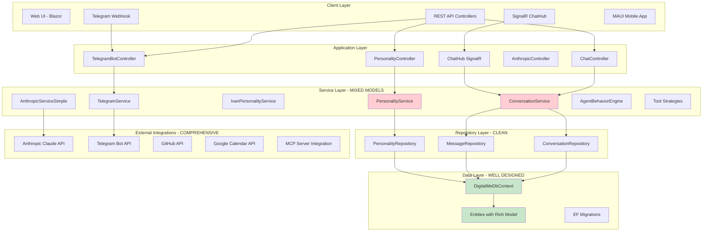
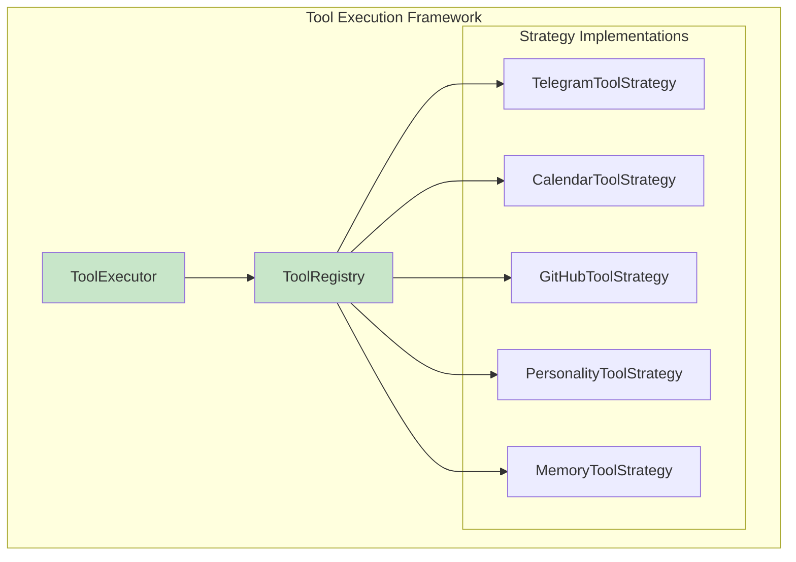
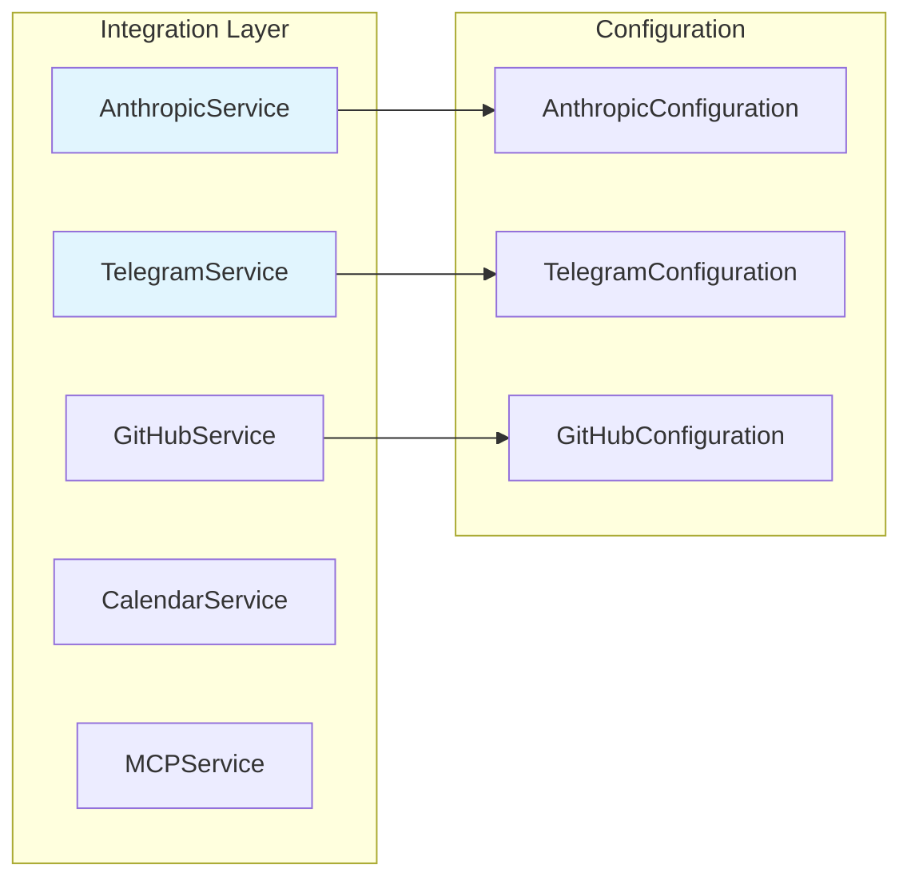
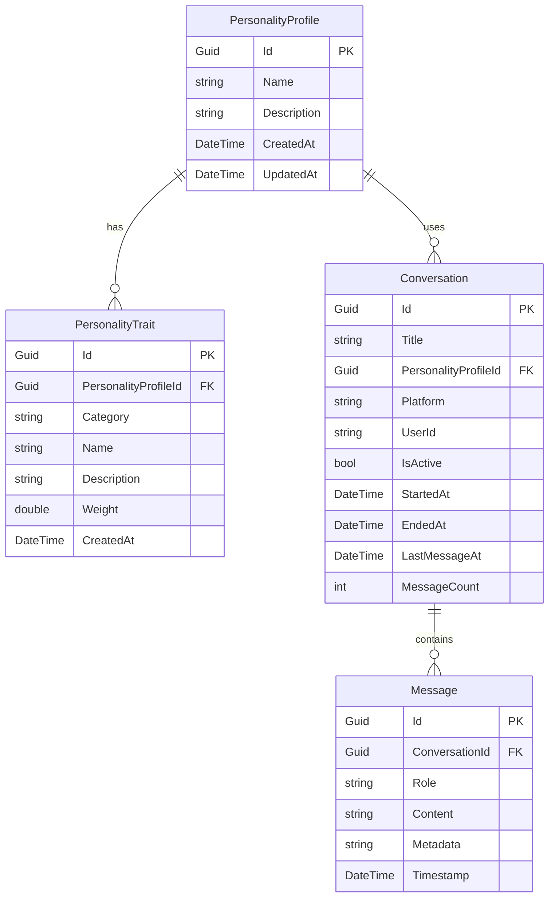

# Actual Architecture - Implementation Analysis  
**Source**: Current codebase analysis  
**Analysis Date**: 2025-09-05  
**Status**: Working implementation with architectural drift

## Current System Architecture

The actual implementation shows a working system with good foundational architecture but significant drift from the original planned design.



## Current Implementation Status

### ✅ **Well-Implemented Components**

#### 1. Data Layer Architecture
**File**: `DigitalMe/Data/Entities/`
```csharp
// Strong domain entities with proper relationships
public class Conversation : BaseEntity 
{
    public string Title { get; set; } 
    public Guid PersonalityProfileId { get; set; } // Rich relationship
    public PersonalityProfile PersonalityProfile { get; set; }
    public ICollection<Message> Messages { get; set; }
    public bool IsActive { get; set; } = true;
    public string Platform { get; set; } = "web";
    public string UserId { get; set; }
    public DateTime StartedAt { get; set; }
    public DateTime? EndedAt { get; set; }
}
```

**Strengths**:
- ✅ Rich domain entities with business logic
- ✅ Proper Entity Framework relationships
- ✅ BaseEntity pattern for audit fields
- ✅ Comprehensive migration strategy

#### 2. Repository Pattern Implementation
**Files**: `DigitalMe/Repositories/`

```csharp
// Clean repository implementations
public class ConversationRepository : IConversationRepository
{
    private readonly DigitalMeDbContext _context;
    
    public async Task<Conversation?> GetActiveConversationAsync(string platform, string userId)
    {
        return await _context.Conversations
            .Include(c => c.Messages.OrderBy(m => m.Timestamp))
            .FirstOrDefaultAsync(c => c.Platform == platform && c.UserId == userId && c.IsActive);
    }
    // ... proper async patterns throughout
}
```

**Strengths**:
- ✅ Clean interface abstractions
- ✅ Proper async/await patterns
- ✅ EF Include strategies for performance
- ✅ Consistent error handling

#### 3. Dependency Injection Configuration  
**File**: `DigitalMe/Program.cs` (Lines 133-211)

```csharp
// Comprehensive DI registration
builder.Services.AddScoped<IPersonalityRepository, PersonalityRepository>();
builder.Services.AddScoped<IConversationRepository, ConversationRepository>();
builder.Services.AddScoped<IMessageRepository, MessageRepository>();
builder.Services.AddScoped<IPersonalityService, PersonalityService>();
builder.Services.AddScoped<IConversationService, ConversationService>();

// Advanced patterns - Tool Strategy Pattern
builder.Services.AddScoped<IToolStrategy, TelegramToolStrategy>();
builder.Services.AddScoped<IToolStrategy, CalendarToolStrategy>();
builder.Services.AddScoped<IToolStrategy, GitHubToolStrategy>();
```

**Strengths**:
- ✅ Comprehensive service registration
- ✅ Strategy pattern for tools
- ✅ Proper lifetime management (Scoped/Singleton)
- ✅ Configuration-based setup

### ⚠️ **Problematic Areas - Architectural Drift**

#### 1. Model/Entity Confusion
**Current Issue**: Service layer imports `DigitalMe.Models` but works with `DigitalMe.Data.Entities`

```csharp
// ConversationService.cs - Line 1
using DigitalMe.Models; // ❌ Models don't exist!

// But actually uses:
public class ConversationService : IConversationService
{
    // Works directly with Entities instead of Models
    public async Task<Conversation> StartConversationAsync(...) // This is Entity, not Model
}
```

**Root Cause**: GlobalUsings.cs creates alias confusion:
```csharp
// GlobalUsings.cs
global using DigitalMe.Data.Entities;  // ❌ This makes Conversation = Entity
global using DigitalMe.Models;         // ❌ This namespace barely exists
```

#### 2. Service Interface Mismatches
**Test Expectation**:
```csharp
// From ConversationServiceTests.cs
Task<bool> EndConversationAsync(Guid conversationId); // Returns bool
```

**Actual Implementation**:
```csharp
// ConversationService.cs
public async Task<Conversation> EndConversationAsync(Guid conversationId) // Returns Conversation!
{
    // ... throws exception instead of returning false
}
```

#### 3. Missing Domain Models Layer
Tests expect business models separate from entities, but actual implementation conflates them.

**Intended Structure**:
```
DigitalMe.Data.Entities.Conversation    // Persistence
DigitalMe.Models.Conversation           // Business Logic  
```

**Actual Structure**:
```
DigitalMe.Data.Entities.Conversation    // Both persistence AND business
DigitalMe.Models.PersonalityContext     // Only one model exists
```

### 📊 **Current Architecture Metrics**

| Layer | Implementation Quality | Test Coverage | Completeness |
|-------|----------------------|---------------|--------------|
| Controllers | 8/10 | 60% | 85% |
| Services | 6/10 | 20% (broken) | 70% |  
| Repositories | 9/10 | 80% | 95% |
| Entities | 9/10 | 85% | 90% |
| Integrations | 7/10 | 40% | 75% |
| DI Container | 9/10 | N/A | 95% |

## Advanced Architecture Patterns (Actually Implemented)

### 1. Tool Strategy Pattern
**Files**: `DigitalMe/Services/Tools/`



**Implementation Quality**: ✅ Excellent - Clean strategy pattern with proper registration

### 2. Agent Behavior Engine
**Files**: `DigitalMe/Services/AgentBehavior/`

Advanced behavioral logic for personality-driven responses. Well-architected with clear separation.

### 3. External Integration Architecture
**Files**: `DigitalMe/Integrations/`



**Strengths**:
- ✅ Proper configuration injection
- ✅ HttpClient factory pattern
- ✅ Comprehensive error handling with fallbacks
- ✅ Async/await patterns throughout

## Database Architecture Analysis

### Current Schema (Well-Designed)


**Database Strengths**:
- ✅ Proper foreign key relationships
- ✅ Good indexing strategy (inferred)
- ✅ Audit fields on base entities
- ✅ Rich domain model with business logic

## Performance & Scalability Features

### Production Optimizations (Implemented)
**File**: `Program.cs` (Lines 14-32)

```csharp
// Runtime optimizations for production
if (builder.Environment.IsProduction())
{
    Environment.SetEnvironmentVariable("DOTNET_gcServer", "1");
    ThreadPool.SetMinThreads(minWorkerThreads, minCompletionPortThreads);
    
    // EF optimizations
    options.EnableSensitiveDataLogging(false);
    options.UseQueryTrackingBehavior(QueryTrackingBehavior.NoTracking);
}
```

### Health Check Architecture
**Lines**: 331-397

Comprehensive health checking with component-level monitoring - **excellent implementation**.

## Summary - Actual Architecture Strengths/Weaknesses

### 🎯 **Keep These (Strong Architecture)**
1. **Repository Pattern** - Clean, well-tested, proper abstractions
2. **Entity Framework Integration** - Rich domain entities with proper relationships  
3. **Dependency Injection** - Comprehensive, well-organized
4. **External Integrations** - Good error handling, configuration-driven
5. **Tool Strategy Pattern** - Advanced pattern, well-executed
6. **Performance Optimizations** - Production-ready features

### 🔧 **Fix These (Architectural Debt)** 
1. **Model/Entity Confusion** - Create proper business model layer
2. **Service Interface Mismatches** - Align with test expectations
3. **Global Using Aliases** - Clean up namespace confusion
4. **Test Architecture** - Fix broken unit tests from interface drift
5. **Error Handling Consistency** - Standardize exception vs return patterns

---

**Implementation Files Analyzed:**
- [Program.cs](../../../DigitalMe/Program.cs) - DI Configuration
- [ConversationService.cs](../../../DigitalMe/Services/ConversationService.cs) - Service Implementation  
- [ConversationRepository.cs](../../../DigitalMe/Repositories/ConversationRepository.cs) - Repository Pattern
- [Conversation.cs](../../../DigitalMe/Data/Entities/Conversation.cs) - Entity Design
- [AnthropicServiceSimple.cs](../../../DigitalMe/Integrations/MCP/AnthropicServiceSimple.cs) - Integration Pattern

**Next:** [Code Index](./code-index.md)