# Email Integration System Architectural Diagrams

**Last Updated**: 2025-09-15
**Status**: ✅ **COMPREHENSIVE VISUAL ARCHITECTURE**
**Documentation Level**: Multi-Level Architectural Visualization
**Clean Architecture Compliance**: ✅ **100%**

## Overview

This document provides comprehensive architectural diagrams for the Email Integration System, illustrating component relationships, data flows, and integration patterns across multiple levels of abstraction.

---

## System Context Diagram

### Email Integration in DigitalMe Platform Context

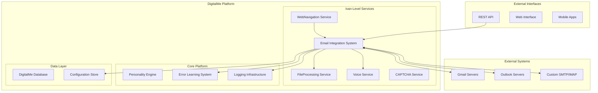

---

## Component Architecture Diagram

### Email System Internal Architecture

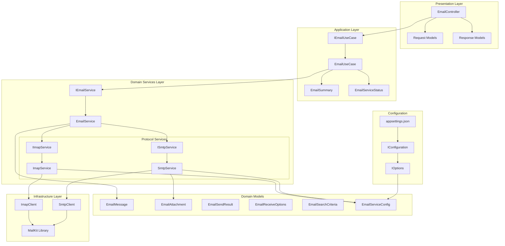

---

## Data Flow Diagrams

### Email Sending Data Flow

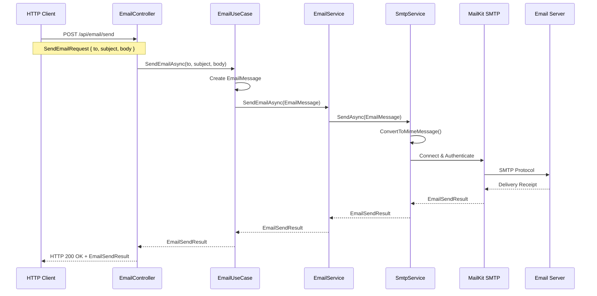

### Email Receiving Data Flow

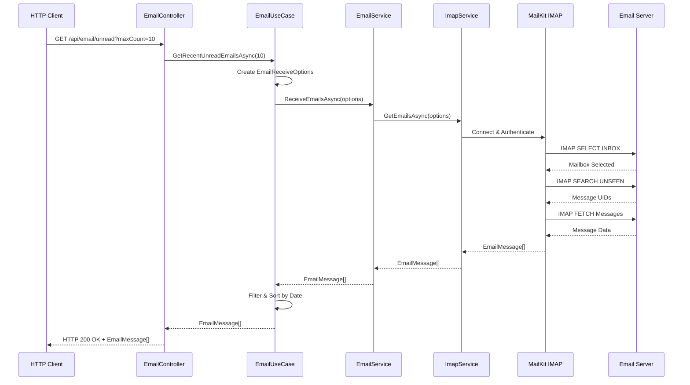

### Attachment Processing Data Flow

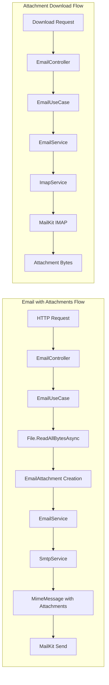

---

## Clean Architecture Layer Visualization

### Layer Dependency Flow

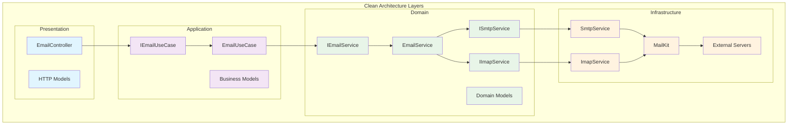

### Dependency Inversion Illustration

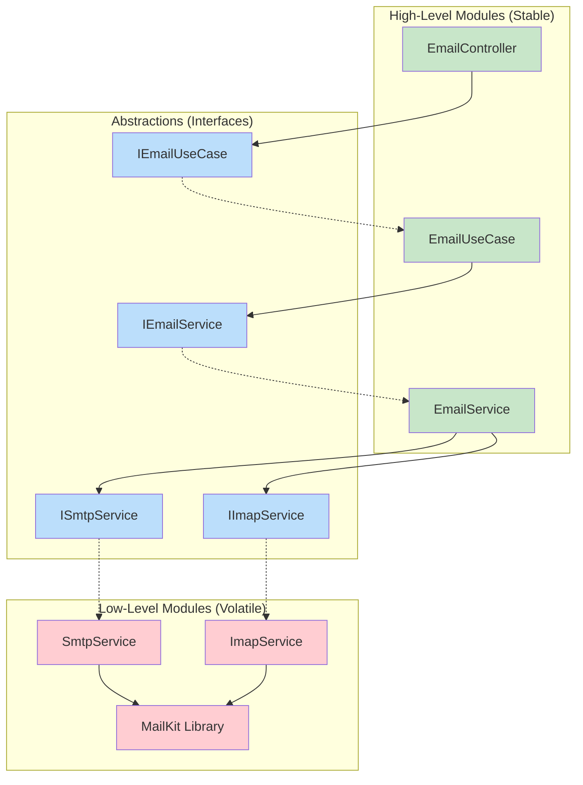

---

## Integration Patterns

### Service Integration Architecture

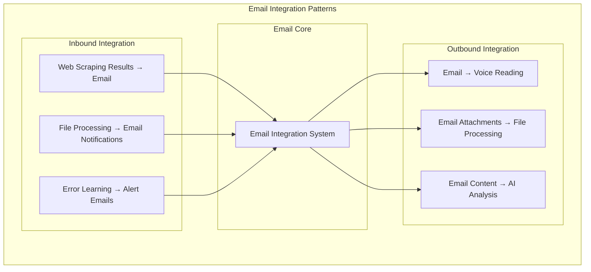

### Configuration Integration Pattern

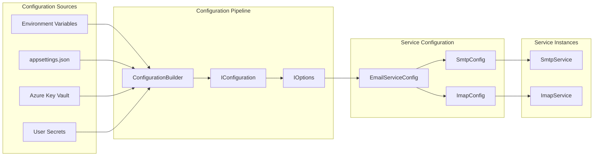

---

## Error Handling Architecture

### Multi-Layer Error Handling Flow

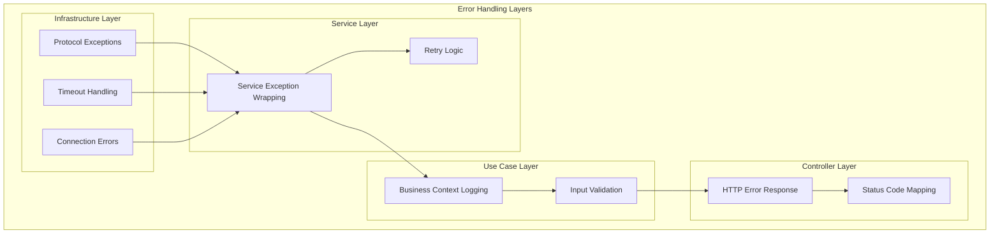

### Exception Flow Diagram

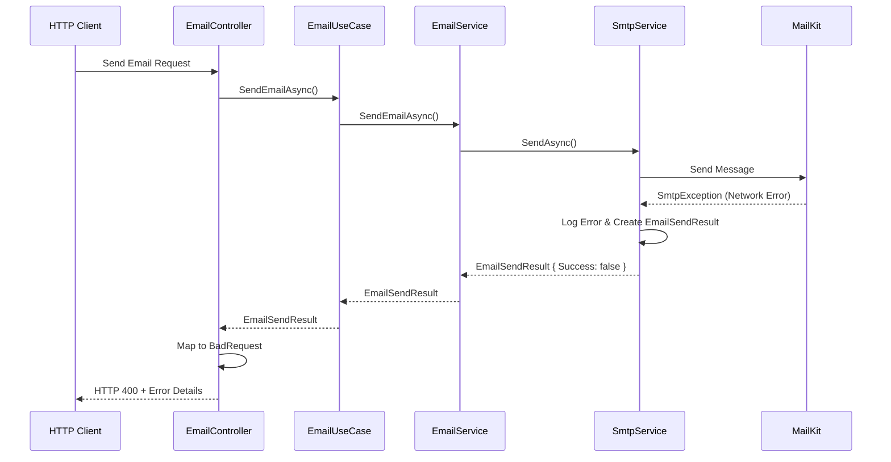

---

## Performance Architecture Diagrams

### Connection Management Architecture

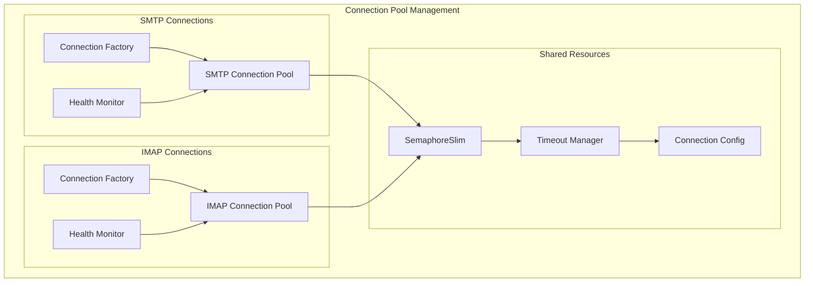

### Async Operations Flow

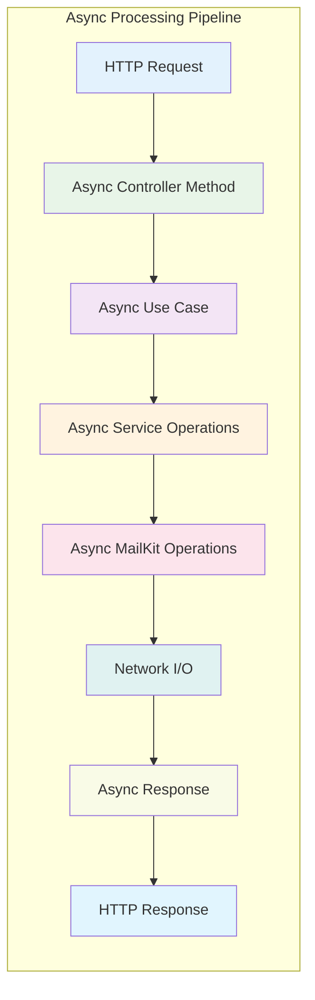

---

## Security Architecture

### Authentication and Authorization Flow

```mermaid
graph TB
    subgraph "Security Layers"
        subgraph "Application Security"
            AUTH[Authentication]
            AUTHZ[Authorization]
            VALID[Input Validation]
        end

        subgraph "Email Security"
            TLS[TLS/SSL Encryption]
            AUTH_MECH[SMTP/IMAP Auth]
            CREDS[Credential Management]
        end

        subgraph "Data Security"
            ENCRYPT[Message Encryption]
            SANITIZE[Data Sanitization]
            AUDIT[Audit Logging]
        end
    end

    AUTH --> AUTHZ
    AUTHZ --> VALID
    VALID --> TLS
    TLS --> AUTH_MECH
    AUTH_MECH --> CREDS
    CREDS --> ENCRYPT
    ENCRYPT --> SANITIZE
    SANITIZE --> AUDIT
```

### Credential Flow Diagram

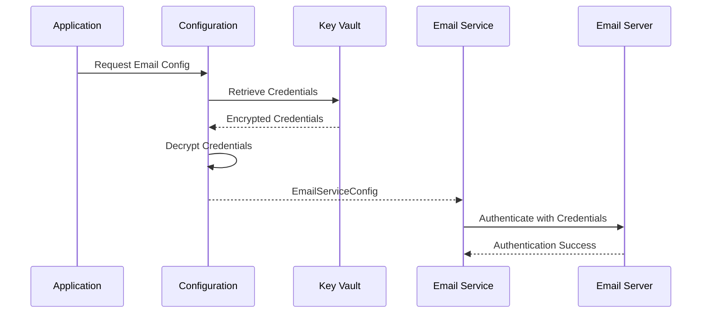

---

## Deployment Architecture

### Service Deployment Topology

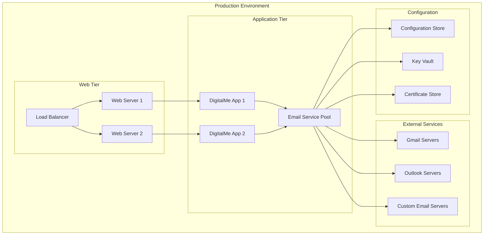

---

## Monitoring and Observability

### Telemetry Architecture

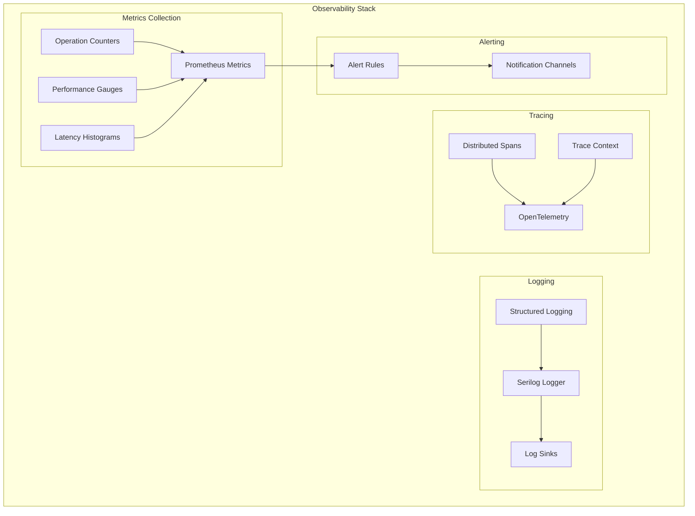

---

## Future Architecture Evolution

### Microservice Evolution Path

```mermaid
graph TB
    subgraph "Current Monolithic Architecture"
        MONO[DigitalMe Application]
        EMAIL_CURRENT[Email Integration (Embedded)]
    end

    subgraph "Target Microservice Architecture"
        subgraph "Email Microservice"
            EMAIL_API[Email API Gateway]
            SEND_SVC[Email Sending Service]
            RECV_SVC[Email Receiving Service]
            MANAGE_SVC[Email Management Service]
        end

        subgraph "Supporting Services"
            TEMPLATE_SVC[Template Service]
            QUEUE_SVC[Message Queue Service]
            NOTIFY_SVC[Notification Service]
        end

        subgraph "Data Layer"
            EMAIL_DB[Email Database]
            TEMPLATE_DB[Template Database]
            QUEUE_DB[Queue Database]
        end
    end

    MONO --> EMAIL_API
    EMAIL_CURRENT -.-> SEND_SVC
    EMAIL_CURRENT -.-> RECV_SVC
    EMAIL_CURRENT -.-> MANAGE_SVC

    EMAIL_API --> SEND_SVC
    EMAIL_API --> RECV_SVC
    EMAIL_API --> MANAGE_SVC

    SEND_SVC --> TEMPLATE_SVC
    RECV_SVC --> QUEUE_SVC
    MANAGE_SVC --> NOTIFY_SVC

    SEND_SVC --> EMAIL_DB
    TEMPLATE_SVC --> TEMPLATE_DB
    QUEUE_SVC --> QUEUE_DB
```

---

## Conclusion

These architectural diagrams provide comprehensive visual documentation of the Email Integration System, illustrating its clean architecture implementation, integration patterns, and future evolution path. The diagrams demonstrate how the system achieves its 8.8/10 architecture score through proper layer separation, dependency management, and integration with the broader DigitalMe platform.

### Diagram Summary
- **System Context**: Platform integration and external dependencies
- **Component Architecture**: Internal structure and relationships
- **Data Flow**: Message processing patterns
- **Clean Architecture**: Layer compliance and dependency inversion
- **Integration**: Service interaction patterns
- **Error Handling**: Multi-layer exception management
- **Performance**: Connection management and async operations
- **Security**: Authentication and encryption flows
- **Deployment**: Production topology and scaling
- **Monitoring**: Observability and telemetry
- **Future Evolution**: Microservice migration path

These diagrams serve as the definitive visual reference for understanding, maintaining, and evolving the Email Integration System within the DigitalMe platform.