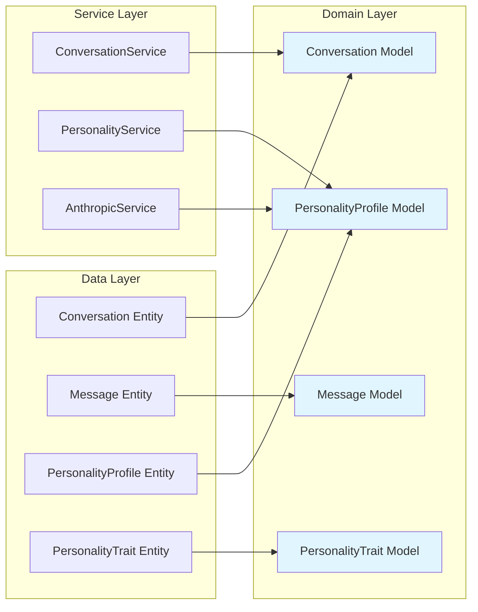
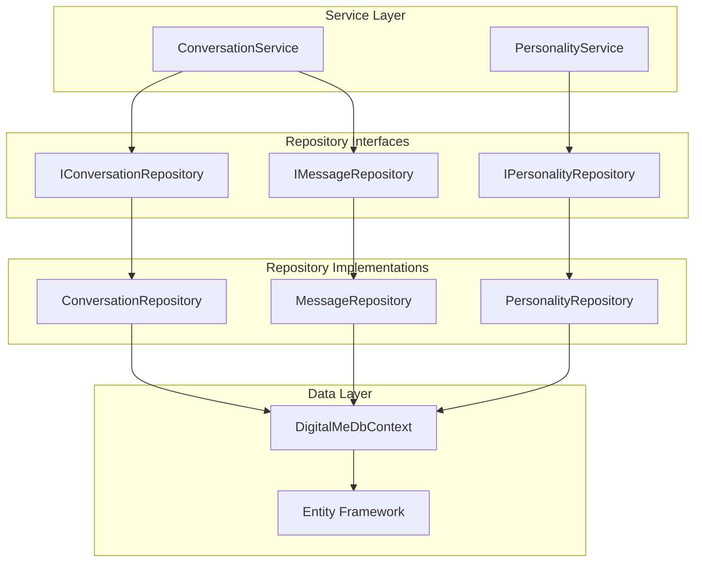
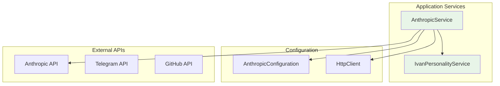

# Planned Architecture - High Level Design
**Source**: Test file analysis and original design intentions  
**Analysis Date**: 2025-09-05  
**Status**: Reverse-engineered from test expectations

## System Overview

Based on test file analysis, the DigitalMe system was originally designed with clean Domain-Driven Design principles and a layered architecture approach.

```mermaid
graph TB
    subgraph "Client Layer"
        WEB[Web UI]
        API[REST API]
        HUB[SignalR Hub]
        TEL[Telegram Bot]
    end
    
    subgraph "Application Layer"
        CON[Controllers]
        SRV[Services]
        HUB_SRV[Hub Services]
    end
    
    subgraph "Domain Layer"
        MOD[Models/DTOs]
        INT[Service Interfaces]
        VAL[Domain Validation]
    end
    
    subgraph "Infrastructure Layer"
        REPO[Repositories]
        EXT[External Integrations]
        DATA[Data Access]
    end
    
    subgraph "Data Layer"
        ENT[Entities]
        CTX[DbContext]
        MIG[Migrations]
    end
    
    WEB --> CON
    API --> CON
    HUB --> HUB_SRV
    TEL --> CON
    
    CON --> SRV
    HUB_SRV --> SRV
    SRV --> MOD
    SRV --> INT
    
    INT --> REPO
    REPO --> ENT
    REPO --> CTX
    
    SRV --> EXT
    EXT --> [Anthropic API]
    EXT --> [Telegram API]
    EXT --> [GitHub API]
    
    style MOD fill:#e1f5fe
    style ENT fill:#f3e5f5
    style SRV fill:#e8f5e8
```

## Planned Domain Architecture

### Core Entities (Data Layer)
From test analysis, these were the intended persistent entities:

1. **Conversation** - Chat session management
   ```csharp
   // Inferred from tests
   class Conversation : BaseEntity
   {
       string Platform { get; set; }
       string UserId { get; set; }
       string Title { get; set; }
       bool IsActive { get; set; }
       DateTime StartedAt { get; set; }
       DateTime? EndedAt { get; set; }
       List<Message> Messages { get; set; }
   }
   ```

2. **Message** - Individual chat messages  
3. **PersonalityProfile** - Digital personality definitions
4. **PersonalityTrait** - Personality characteristics with weights

### Planned Business Models (Domain Layer)

The original design intended **separate Models** for business logic, distinct from data entities:



## Planned Service Layer Architecture

### Service Contracts
From test analysis, services were designed with specific contracts:

1. **ConversationService**
   ```csharp
   interface IConversationService
   {
       Task<Conversation> StartConversationAsync(string platform, string userId, string title);
       Task<Message> AddMessageAsync(Guid conversationId, string role, string content, metadata);
       Task<IEnumerable<Message>> GetConversationHistoryAsync(Guid conversationId, int limit);
       Task<bool> EndConversationAsync(Guid conversationId); // Returns bool, not Conversation
       Task<IEnumerable<Conversation>> GetUserConversationsAsync(string platform, string userId);
   }
   ```

2. **PersonalityService** 
   ```csharp
   interface IPersonalityService  
   {
       Task<PersonalityProfile?> GetPersonalityAsync(string name);
       Task<PersonalityProfile> CreatePersonalityAsync(string name, string description);
       Task<PersonalityProfile> UpdatePersonalityAsync(Guid id, string description);
       Task<string> GenerateSystemPromptAsync(Guid personalityId);
       Task<PersonalityTrait> AddTraitAsync(Guid personalityId, string category, string name, string description, double weight = 1.0);
       Task<bool> DeletePersonalityAsync(Guid id);
   }
   ```

### Repository Layer Pattern

Tests indicate a clean Repository pattern with proper abstractions:



## Planned Integration Architecture

### External Service Integration
From AnthropicService tests, the planned integration pattern:



### Planned Error Handling Strategy

Tests indicate sophisticated error handling:
- **Network errors** → Fallback responses in Russian
- **API errors** → Graceful degradation with logging
- **Configuration errors** → Fallback to local responses
- **Data errors** → Specific exception types with meaningful messages

## Testing Architecture Design

The planned testing architecture shows comprehensive patterns:

### Test Structure
```
tests/
├── DigitalMe.Tests.Unit/
│   ├── Builders/ (Test data builders)
│   ├── Fixtures/ (Test data fixtures) 
│   ├── Services/ (Service layer tests)
│   ├── Repositories/ (Repository tests)
│   └── Controllers/ (Controller tests)
└── DigitalMe.Tests.Integration/
    ├── CustomWebApplicationFactory.cs
    ├── IntegrationTestBase.cs
    └── Feature-specific integration tests
```

### Planned Testing Patterns
1. **Builder Pattern** - For creating test data objects
2. **Repository Mocking** - Services tested with mocked repositories  
3. **In-Memory Database** - For repository integration tests
4. **Custom Web Factory** - For integration testing with proper DI
5. **Fluent Assertions** - For readable test assertions

## Key Design Principles

Based on test analysis, the original architecture followed:

1. **Separation of Concerns** - Clear layers with distinct responsibilities
2. **Dependency Inversion** - Services depend on interfaces, not implementations
3. **Domain-Driven Design** - Rich entities with business logic
4. **Repository Pattern** - Clean data access abstraction
5. **Configuration-based** - External service configuration through appsettings
6. **Testability First** - Designed for comprehensive unit and integration testing

---

**References:**
- [ConversationServiceTests.cs](../../../tests/DigitalMe.Tests.Unit/Services/ConversationServiceTests.cs)
- [PersonalityServiceTests.cs](../../../tests/DigitalMe.Tests.Unit/Services/PersonalityServiceTests.cs)
- [AnthropicServiceTests.cs](../../../tests/DigitalMe.Tests.Unit/Integrations/AnthropicServiceTests.cs)
- [PersonalityRepositoryTests.cs](../../../tests/DigitalMe.Tests.Unit/Repositories/PersonalityRepositoryTests.cs)

**Next:** [Component Contracts](./component-contracts.md)