# Security Hardening Component Interactions

**Document Type**: Component Interaction Analysis
**Last Updated**: 2025-09-15
**Status**: Production Implementation Analysis
**Architecture Score**: 8.4/10

## Component Interaction Overview

The Security Hardening system implements a sophisticated interaction pattern between middleware components, services, and external dependencies. This document provides detailed analysis of how security components collaborate to provide comprehensive protection.

## Middleware Pipeline Interactions

### Request Processing Flow

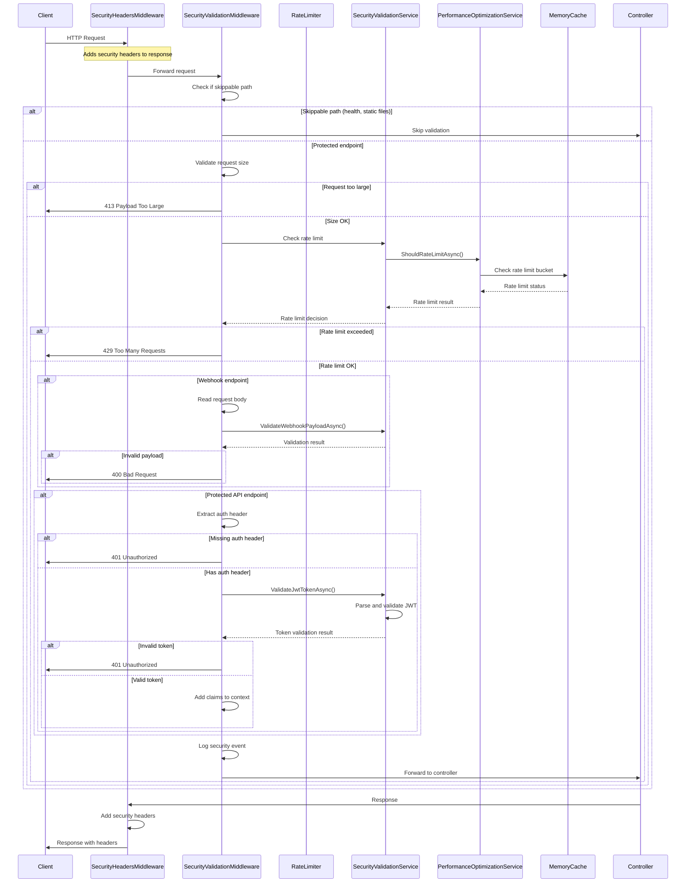

### Component State Management

#### SecurityHeadersMiddleware State
- **Stateless**: No persistent state between requests
- **Configuration**: Static header configuration
- **Response Modification**: Headers added in response phase

```csharp
// Stateless header application
private static void AddSecurityHeaders(HttpContext context)
{
    var response = context.Response;

    // Headers applied only if not already present
    if (!response.Headers.ContainsKey("X-Frame-Options"))
    {
        response.Headers["X-Frame-Options"] = "DENY";
    }
    // ... additional headers
}
```

#### SecurityValidationMiddleware State
- **Request Scoped**: Context-specific validation
- **Service Dependencies**: Injected security service
- **Validation Cache**: Per-request validation results

```csharp
public async Task InvokeAsync(HttpContext context, ISecurityValidationService securityService)
{
    // Context-specific client identification
    var clientId = GetClientIdentifier(context);
    var endpoint = $"{context.Request.Method}:{context.Request.Path}";

    // Request-scoped validation
    if (await securityService.IsRateLimitExceededAsync(clientId, endpoint))
    {
        // Rate limit enforcement
    }
}
```

## Service Layer Interactions

### SecurityValidationService Dependencies

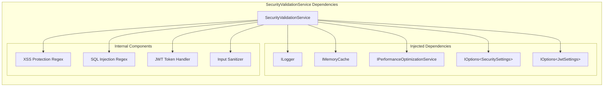

### Rate Limiting Integration Pattern

#### SecurityValidationService → PerformanceOptimizationService

```csharp
public async Task<bool> IsRateLimitExceededAsync(string clientIdentifier, string endpoint)
{
    if (!_securitySettings.EnableRateLimiting)
        return false;

    try
    {
        // Delegate to performance service with security context
        return await _performanceService.ShouldRateLimitAsync("security", $"{clientIdentifier}:{endpoint}");
    }
    catch (Exception ex)
    {
        _logger.LogError(ex, "Error checking rate limit for {ClientId}:{Endpoint}",
            clientIdentifier, endpoint);
        // Fail open for availability
        return false;
    }
}
```

#### PerformanceOptimizationService Rate Limiting Logic

```csharp
public Task<bool> ShouldRateLimitAsync(string serviceName, string identifier)
{
    var key = $"{serviceName}:{identifier}";
    var bucket = _rateLimitBuckets.GetOrAdd(key, _ => new RateLimitBucket(serviceName, identifier, _settings));

    return Task.FromResult(bucket.ShouldRateLimit());
}
```

### Rate Limit Bucket Management

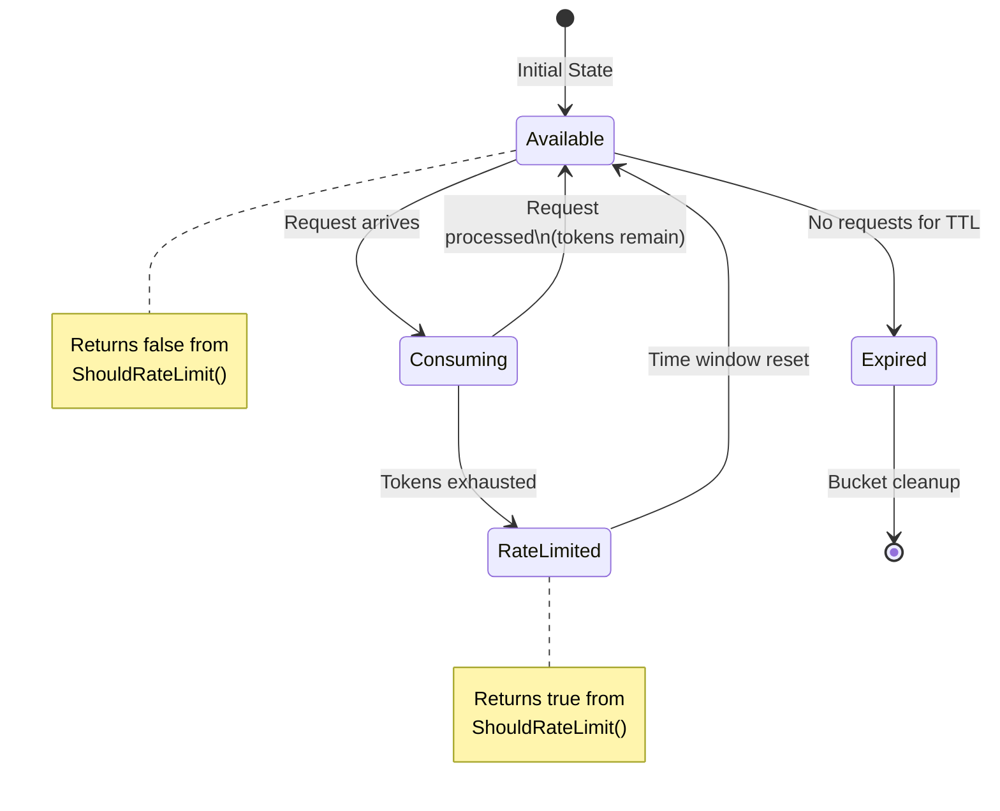

## Input Processing Interactions

### Request Validation Flow

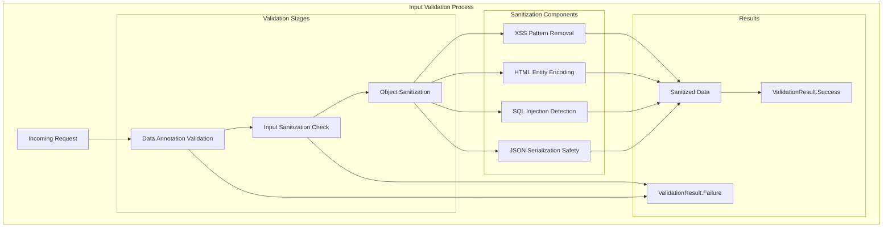

### Sanitization Process Details

#### XSS Protection Chain
```csharp
// 1. Script tag removal
input = _scriptPattern.Replace(input, string.Empty);

// 2. Event handler removal
input = _onEventPattern.Replace(input, string.Empty);

// 3. JavaScript protocol removal
input = _javascriptPattern.Replace(input, string.Empty);

// 4. HTML entity encoding
input = input.Replace("<", "&lt;")
            .Replace(">", "&gt;")
            .Replace("\"", "&quot;")
            .Replace("'", "&#x27;")
            .Replace("/", "&#x2F;");
```

#### SQL Injection Detection
```csharp
if (_sqlPattern.IsMatch(input))
{
    _logger.LogWarning("Potential SQL injection pattern detected in input, sanitizing");
    input = _sqlPattern.Replace(input, string.Empty);
}
```

## JWT Token Validation Interactions

### Token Processing Flow

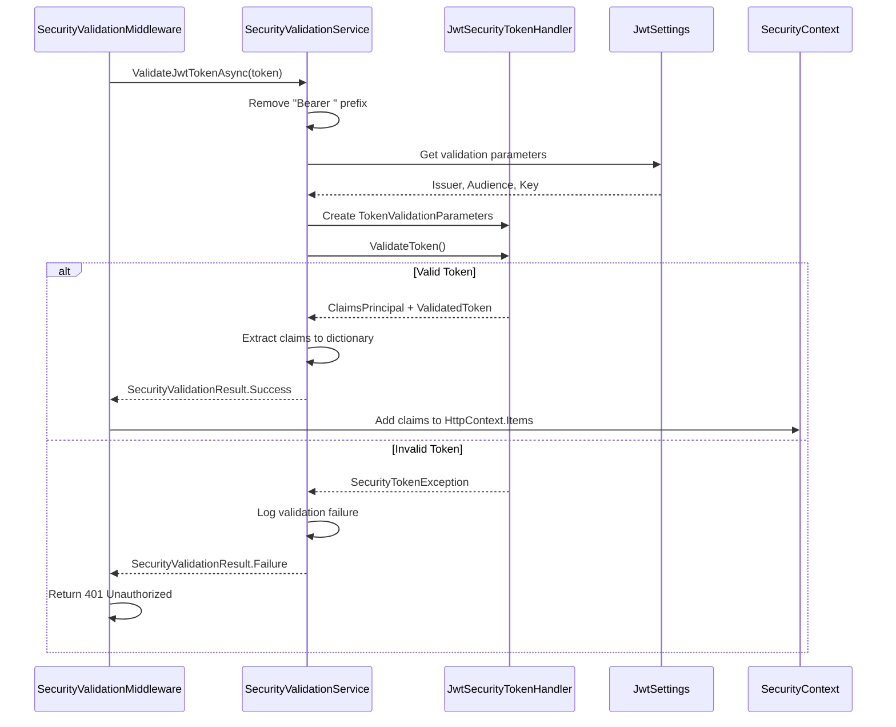

### Claims Integration Pattern

```csharp
// In SecurityValidationMiddleware
var tokenValidation = await securityService.ValidateJwtTokenAsync(authHeader);
if (!tokenValidation.IsValid)
{
    context.Response.StatusCode = 401;
    await context.Response.WriteAsync("Invalid token");
    return;
}

// Add claims to context for controller access
foreach (var claim in tokenValidation.Claims)
{
    context.Items[$"claim:{claim.Key}"] = claim.Value;
}
```

## Error Handling Interactions

### Exception Flow Management

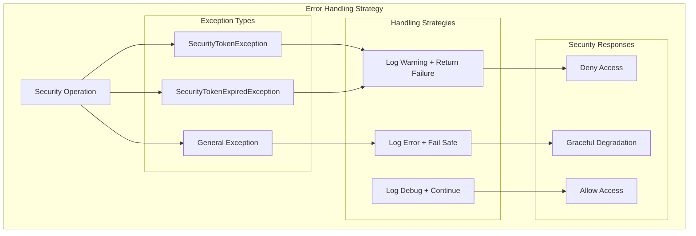

### Fail-Safe Design Patterns

#### Rate Limiting Failure
```csharp
public async Task<bool> IsRateLimitExceededAsync(string clientIdentifier, string endpoint)
{
    try
    {
        return await _performanceService.ShouldRateLimitAsync("security", $"{clientIdentifier}:{endpoint}");
    }
    catch (Exception ex)
    {
        _logger.LogError(ex, "Error checking rate limit for {ClientId}:{Endpoint}",
            clientIdentifier, endpoint);
        // FAIL OPEN: Allow request on error to avoid blocking legitimate traffic
        return false;
    }
}
```

#### Input Sanitization Failure
```csharp
public string SanitizeInput(string input)
{
    try
    {
        // Sanitization logic
        return sanitizedInput;
    }
    catch (Exception ex)
    {
        _logger.LogError(ex, "Error sanitizing input: {Input}", input);
        // FAIL SECURE: Return empty string on error for safety
        return string.Empty;
    }
}
```

## Performance Optimization Interactions

### Caching Strategy

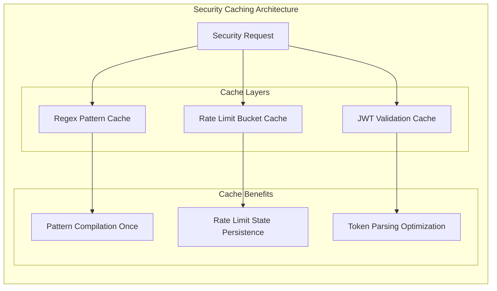

### Regex Pattern Compilation

```csharp
// Compiled at class initialization for performance
private readonly Regex _scriptPattern = new(@"<script[^>]*>.*?</script>",
    RegexOptions.IgnoreCase | RegexOptions.Compiled);
private readonly Regex _onEventPattern = new(@"on\w+\s*=",
    RegexOptions.IgnoreCase | RegexOptions.Compiled);
private readonly Regex _javascriptPattern = new(@"javascript:",
    RegexOptions.IgnoreCase | RegexOptions.Compiled);
private readonly Regex _sqlPattern = new(@"(;|\||'|--|\*|/\*|\*/|xp_|sp_)",
    RegexOptions.IgnoreCase | RegexOptions.Compiled);
```

## Configuration Interactions

### Settings Injection Pattern

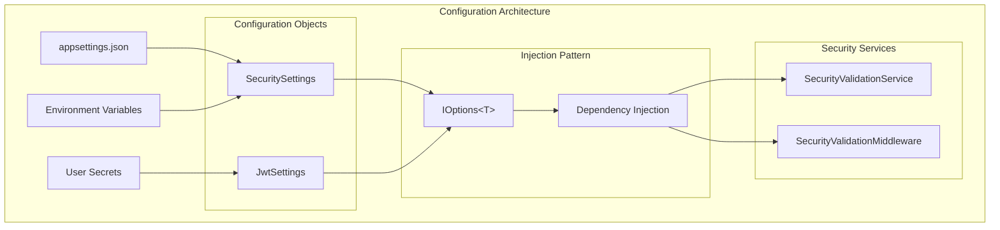

### Configuration Validation

```csharp
public SecurityValidationService(
    ILogger<SecurityValidationService> logger,
    IMemoryCache cache,
    IPerformanceOptimizationService performanceService,
    IOptions<SecuritySettings> securitySettings,
    IOptions<JwtSettings> jwtSettings)
{
    _securitySettings = securitySettings.Value;
    _jwtSettings = jwtSettings.Value;

    // Configuration validation could be added here
    if (string.IsNullOrEmpty(_jwtSettings.Key))
    {
        throw new InvalidOperationException("JWT key must be configured");
    }
}
```

## Monitoring and Logging Interactions

### Security Event Correlation

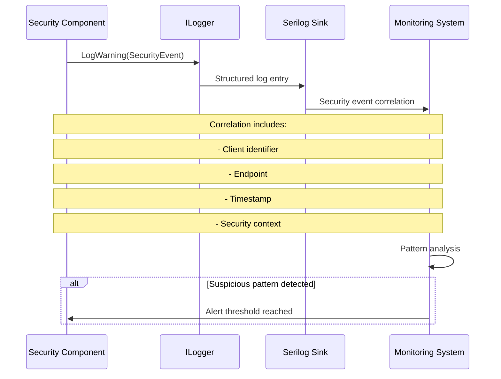

### Security Metrics Collection

```csharp
// Rate limit violation logging
_logger.LogWarning("Rate limit exceeded for {ClientId} on {Endpoint}", clientId, endpoint);

// Potential attack detection
_logger.LogWarning("Potential SQL injection pattern detected in input, sanitizing");

// Authentication failures
_logger.LogWarning("JWT validation failed: {Message}", ex.Message);

// Successful validation (debug level)
_logger.LogDebug("Security validation passed for {ClientId} {Method} {Path}",
    clientId, context.Request.Method, context.Request.Path);
```

## Thread Safety and Concurrency

### Concurrent Access Patterns

#### Rate Limit Bucket Concurrency
```csharp
// Thread-safe concurrent dictionary for rate limit buckets
private readonly ConcurrentDictionary<string, RateLimitBucket> _rateLimitBuckets;

// Atomic bucket creation and access
var bucket = _rateLimitBuckets.GetOrAdd(key, _ => new RateLimitBucket(serviceName, identifier, _settings));
```

#### Regex Pattern Thread Safety
```csharp
// Immutable regex patterns - thread-safe by design
private readonly Regex _scriptPattern = new(@"<script[^>]*>.*?</script>",
    RegexOptions.IgnoreCase | RegexOptions.Compiled);
```

#### Memory Cache Thread Safety
```csharp
// IMemoryCache is thread-safe
if (_cache.TryGetValue(cacheKey, out var cachedValue) && cachedValue is T result)
{
    return result;
}
```

## Component Lifecycle Management

### Service Lifetime Scopes

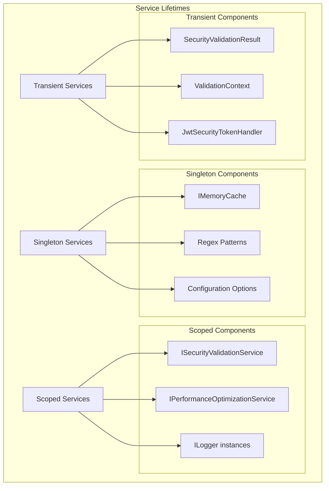

## Integration Test Interactions

### Test Scenario Coverage

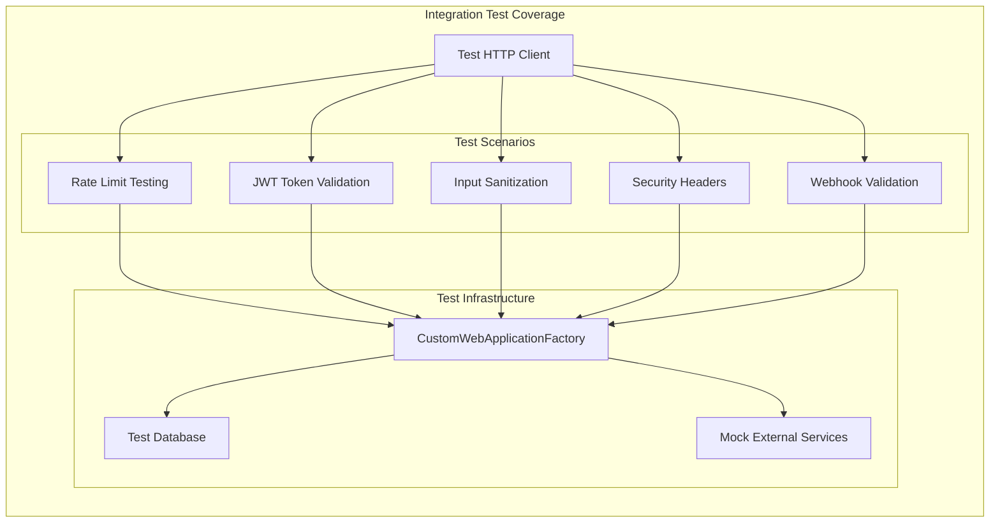

## Summary

The Security Hardening component interactions demonstrate a well-orchestrated security architecture that provides:

1. **Layered Defense**: Multiple interaction points ensure comprehensive protection
2. **Performance Optimization**: Caching and efficient patterns minimize overhead
3. **Fault Tolerance**: Graceful degradation and fail-safe patterns maintain availability
4. **Observability**: Comprehensive logging and monitoring integration
5. **Configurability**: Flexible configuration with proper validation
6. **Thread Safety**: Concurrent access patterns designed for high-load scenarios

The interaction patterns show mature security engineering practices with proper separation of concerns, dependency injection, and production-ready error handling.