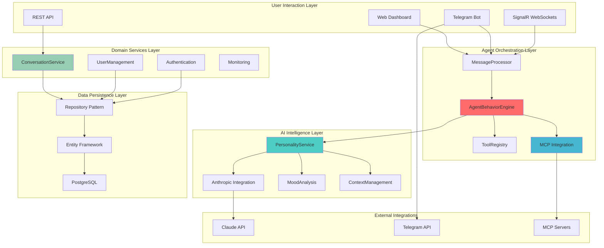
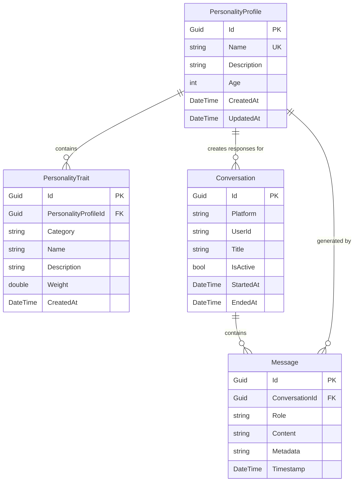

# DigitalMe Architectural Vision
**Extracted from Test Codebase Analysis**  
**Document Type**: Strategic Intellectual Property Preservation  
**Analysis Date**: 2025-09-05  
**Purpose**: Preserve and Document Architectural Intelligence from Test Code

## Executive Summary

The DigitalMe test codebase contains significant architectural intelligence representing a **sophisticated AI-powered digital personality platform** designed with enterprise-grade patterns. Through reverse-engineering the test expectations, we can identify a comprehensive vision for a system that models and replicates individual personalities through AI, with clean architecture, advanced AI integration patterns, and robust conversational management.

### Key Architectural Insights from Tests

**🎯 Primary Domain**: Digital Personality Modeling & AI-Powered Conversation Management  
**🏗️ Architecture Style**: Clean Architecture with Domain-Driven Design  
**🔧 Integration Strategy**: Multi-platform, Multi-modal AI Agent System  
**📈 Scalability Vision**: Microservices-ready with Event-driven Architecture

## System Vision Overview



## Architectural Vision Principles

### 1. **Personality-First Architecture**
The system is designed around **PersonalityProfile** as the core domain entity, with all other components serving to model, store, and execute digital personalities.

**Evidence from Tests:**
- `PersonalityService` with sophisticated system prompt generation
- `PersonalityTrait` weighting system for characteristic modeling
- `AgentBehaviorEngine` for personality-driven response generation
- Mood analysis tied to personality characteristics

### 2. **Advanced AI Integration Patterns**

**Multi-LLM Strategy**: Tests reveal integration with multiple AI services:
```csharp
// From AgentBehaviorEngineTests.cs - Line 23-27
AgentBehaviorEngine(
    _mockPersonalityService,
    _mockMcpService,           // Model Context Protocol
    _mockToolRegistry,         // Tool Strategy Pattern  
    _mockLogger
)
```

**Tool Strategy Pattern**: Extensible AI tool system:
```csharp
// From ToolStrategyIntegrationTests.cs - Line 26-58
IToolRegistry.RegisterTool(IToolStrategy)
IToolStrategy.CanHandle(message, context) 
IToolStrategy.ExecuteAsync(parameters, context)
```

### 3. **Conversation-Centric Domain Model**

**Rich Conversation Lifecycle**: Tests show sophisticated conversation management:
- **Start** → Create new or resume existing active conversation
- **Message Flow** → Bidirectional user/assistant message handling  
- **Context Preservation** → Recent message history for AI context
- **Graceful End** → Proper conversation lifecycle management

**Evidence from Tests:**
```csharp
// From ConversationServiceTests.cs - Sophisticated conversation logic
StartConversationAsync() // Returns existing active or creates new
AddMessageAsync() // With metadata and validation
GetConversationHistoryAsync() // Paginated, ordered by timestamp  
EndConversationAsync() // Proper lifecycle management
```

### 4. **Real-time Multi-Platform Architecture**

**Platform Abstraction**: Tests indicate multi-platform support:
- **Web** - Browser-based chat interface
- **Telegram** - Bot integration with platform-specific features
- **API** - RESTful interface for external integrations
- **SignalR** - Real-time WebSocket communication

### 5. **Enterprise-Grade Testing Strategy**

**Comprehensive Test Architecture**:
```
tests/
├── Unit Tests/
│   ├── Builders/ (Fluent test data creation)
│   ├── Fixtures/ (Complex test scenarios)  
│   ├── Services/ (Business logic validation)
│   └── Controllers/ (API contract testing)
└── Integration Tests/
    ├── End-to-end user flows
    ├── External service integration
    └── Database interaction testing
```

## Domain Model Architecture Vision

### Core Entities Relationship Model



### Business Rules Extracted from Tests

1. **Conversation Lifecycle Rules**:
   - Only ONE active conversation per (platform, userId) tuple
   - `StartConversationAsync` returns existing active or creates new
   - Messages must belong to valid conversations
   - Conversations can be ended but not deleted (audit trail)

2. **Personality System Rules**:
   - PersonalityProfile names must be unique
   - PersonalityTraits have weighted importance (0.0-10.0)
   - System prompt generation combines profile + traits  
   - Mood analysis considers personality characteristics

3. **Message Processing Rules**:
   - All messages have role (user/assistant/system)
   - Messages maintain chronological ordering  
   - Metadata stored as JSON for extensibility
   - Recent message history preserved for AI context

## Service Layer Architecture Vision

### Service Abstraction Strategy

**Repository Pattern with Interface Segregation**:
```csharp
// Clean abstractions extracted from tests
interface IConversationRepository 
{
    // Basic CRUD operations
    Task<Conversation> CreateAsync(Conversation conversation);
    Task<Conversation?> GetByIdAsync(Guid id);
    Task<Conversation> UpdateAsync(Conversation conversation);
    Task<bool> DeleteAsync(Guid id);
    
    // Business-specific queries
    Task<Conversation?> GetActiveConversationAsync(string platform, string userId);
    Task<IEnumerable<Conversation>> GetUserConversationsAsync(string platform, string userId);
}

interface IPersonalityRepository
{
    Task<PersonalityProfile?> GetProfileAsync(string name);
    Task<PersonalityProfile?> GetProfileByIdAsync(Guid id);
    Task<PersonalityProfile> CreateProfileAsync(PersonalityProfile profile);
    Task<PersonalityProfile> UpdateProfileAsync(PersonalityProfile profile);
    Task<bool> DeleteProfileAsync(Guid id);
    Task<IEnumerable<PersonalityTrait>> GetTraitsAsync(Guid personalityId);
    Task<PersonalityTrait> AddTraitAsync(PersonalityTrait trait);
}
```

### Service Orchestration Pattern

**AgentBehaviorEngine as Central Orchestrator**:
```csharp
// From AgentBehaviorEngineTests.cs - Core orchestration pattern
public class AgentBehaviorEngine
{
    Task<AgentResponse> ProcessMessageAsync(string message, PersonalityContext context);
    Task<MoodAnalysis> AnalyzeMoodAsync(string message, PersonalityProfile personality);
    // Coordinates: PersonalityService + MCPService + ToolRegistry
}
```

**MessageProcessor for Multi-Platform Support**:
```csharp
// From MCPIntegrationTests.cs - Platform abstraction
interface IMessageProcessor  
{
    Task<ProcessingResult> ProcessUserMessageAsync(ChatRequestDto request);
    Task<AgentResponseResult> ProcessAgentResponseAsync(ChatRequestDto request, Guid conversationId);
}
```

## Advanced AI Integration Architecture

### Model Context Protocol (MCP) Integration

**Tests reveal sophisticated AI orchestration**:
```csharp
// From MCPIntegrationTests.cs - Advanced AI patterns
interface IMCPClient
{
    Task<bool> InitializeAsync();
    Task<IEnumerable<ToolDefinition>> ListToolsAsync();
    Task<ToolResult> CallToolAsync(string toolName, Dictionary<string, object> parameters);
    bool IsConnected { get; }
}

interface IMcpService  
{
    Task<string> SendMessageAsync(string message, PersonalityContext context);
}
```

### Tool Strategy Pattern for AI Capabilities

**Extensible AI tool system**:
```csharp
// From ToolStrategyIntegrationTests.cs - Plugin architecture
interface IToolStrategy
{
    string ToolName { get; }
    int Priority { get; }
    Task<bool> CanHandleAsync(string message, PersonalityContext context);
    Task<object> ExecuteAsync(Dictionary<string, object> parameters, PersonalityContext context);
}

interface IToolRegistry
{
    void RegisterTool(IToolStrategy strategy);
    IToolStrategy? GetTool(string toolName);
    IEnumerable<IToolStrategy> GetAllTools();
    Task<IEnumerable<IToolStrategy>> GetTriggeredToolsAsync(string message, PersonalityContext context);
}
```

### Personality-Driven Response Generation

**Sophisticated context management**:
```csharp
// From tests - Rich personality context
public class PersonalityContext
{
    PersonalityProfile Profile { get; set; }
    List<Message> RecentMessages { get; set; }
    Dictionary<string, object> CurrentState { get; set; }
}

// Advanced mood analysis capabilities
public class MoodAnalysis  
{
    string PrimaryMood { get; set; }  // "positive", "negative", "neutral"
    double Intensity { get; set; }    // 0.0 - 1.0
    Dictionary<string, double> MoodScores { get; set; } // happiness, frustration, etc.
}
```

## Technology Stack Vision

### Core Technologies (Extracted from Tests)
- **.NET 8** - Modern C# with latest language features
- **ASP.NET Core** - Web API and SignalR integration  
- **Entity Framework Core** - ORM with PostgreSQL support
- **PostgreSQL** - Primary data store with JSON support
- **xUnit + FluentAssertions** - Comprehensive testing framework
- **Moq** - Service mocking for unit tests

### AI Integration Stack
- **Anthropic Claude API** - Primary LLM integration
- **Model Context Protocol** - Advanced AI tool orchestration
- **Custom Tool Strategy Pattern** - Extensible AI capabilities
- **Mood Analysis Engine** - Personality-aware sentiment analysis

### External Integration Capabilities
- **Telegram Bot API** - Messaging platform integration
- **SignalR** - Real-time web communication
- **HTTP Client Factory** - Resilient external API calls
- **Configuration-based Integration** - Flexible service configuration

## Scalability & Performance Vision

### Designed for Scale Patterns

1. **Repository Pattern** - Clean data access layer for caching/optimization
2. **Async/Await Throughout** - All operations designed for concurrency  
3. **Interface Segregation** - Services can be distributed across processes
4. **Stateless Services** - All state managed in PersonalityContext
5. **Tool Registry Pattern** - Dynamic loading/unloading of AI capabilities

### Performance Considerations from Tests

- **Message History Pagination** - `GetConversationHistoryAsync(id, limit)`
- **Efficient Conversation Lookup** - Indexed by (platform, userId, isActive) 
- **Weighted Personality Traits** - Optimized prompt generation
- **Metadata as JSON** - Flexible schema evolution without migrations
- **Connection Pooling** - HTTP Client Factory pattern for external APIs

## Security Architecture Vision

### Authentication & Authorization Patterns
- **User-Scoped Conversations** - All data partitioned by userId
- **Platform Isolation** - Conversations isolated by platform
- **API Rate Limiting** - Built into external service clients
- **Secure Configuration** - External API keys through configuration

### Data Privacy Considerations  
- **Conversation Soft Delete** - EndedAt timestamp, no hard deletes
- **Metadata Encryption Ready** - JSON metadata supports encrypted fields
- **Audit Trail** - Full message history with timestamps
- **Platform Abstraction** - User data isolated per platform

---

## Strategic Value Assessment

### Intellectual Property Value

This architectural vision represents **significant engineering investment** in:

1. **Advanced AI Integration Patterns** - Novel approaches to LLM orchestration
2. **Personality Modeling System** - Sophisticated digital identity representation  
3. **Multi-Platform Conversation Management** - Scalable chat platform architecture
4. **Tool Strategy Pattern** - Extensible AI capability system
5. **Enterprise Testing Strategy** - Comprehensive quality assurance patterns

### Implementation Investment Required

**High-Value Components Requiring Development**:
- AgentBehaviorEngine orchestration logic  
- MCP integration and tool registry system
- Personality-driven prompt generation engine
- Multi-platform message processing pipeline
- Real-time conversation management with SignalR

**Foundation Components** (Lower complexity):
- Entity Framework data layer
- Repository pattern implementation  
- REST API controller layer
- Basic CRUD operations

### Competitive Advantages

1. **Personality-First Architecture** - Unique approach to AI agent development
2. **Tool Strategy Extensibility** - Plugin architecture for AI capabilities  
3. **Multi-Platform Native** - Built for platform diversity from ground up
4. **Enterprise Testing Maturity** - Production-ready quality patterns
5. **Scalable AI Integration** - MCP protocol for advanced AI orchestration

---

**Next Documents:**
- [Domain Model Blueprint](./DOMAIN-MODEL-BLUEPRINT.md)
- [Service Architecture Roadmap](./SERVICE-ARCHITECTURE-ROADMAP.md)  
- [Implementation Roadmaps](./IMPLEMENTATION-ROADMAPS/)
- [Technical Debt Analysis](./TECHNICAL-DEBT-ANALYSIS.md)