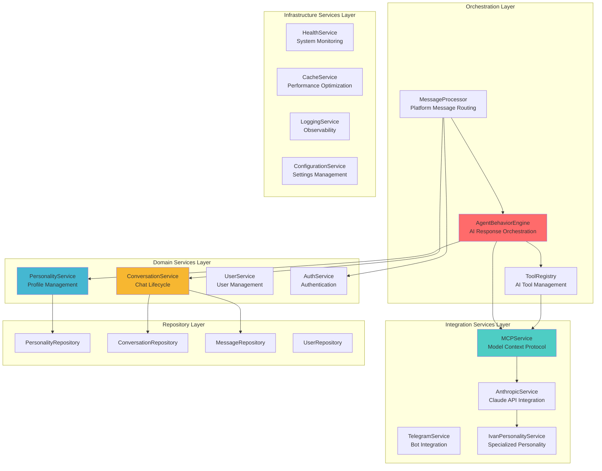

# Service Architecture Roadmap
**Extracted from Test-Driven Design Intelligence**  
**Document Type**: Service Layer Implementation Blueprint  
**Analysis Date**: 2025-09-05  
**Source**: Service Tests, Integration Tests, and Mocking Patterns

## Service Architecture Overview

The DigitalMe service layer, reverse-engineered from comprehensive test analysis, reveals a **sophisticated multi-layered service architecture** designed for AI-powered personality modeling with clean separation of concerns, advanced integration patterns, and enterprise-grade resilience.

### Service Layer Hierarchy



## Core Service Implementations

### AgentBehaviorEngine (Primary Orchestrator)

**Responsibility**: Central AI orchestration service that coordinates personality-driven response generation with mood analysis, tool integration, and external AI services.

```csharp
// Extracted from AgentBehaviorEngineTests.cs - Core service contract
public interface IAgentBehaviorEngine
{
    // Primary orchestration method
    Task<AgentResponse> ProcessMessageAsync(string message, PersonalityContext context);
    
    // Advanced AI capabilities
    Task<MoodAnalysis> AnalyzeMoodAsync(string message, PersonalityProfile personality);
    Task<IEnumerable<IToolStrategy>> GetTriggeredToolsAsync(string message, PersonalityContext context);
    
    // Response generation pipeline
    Task<string> GenerateContextualResponseAsync(string message, PersonalityProfile personality, 
                                                IEnumerable<Message> recentMessages);
}

public class AgentBehaviorEngine : IAgentBehaviorEngine
{
    private readonly IPersonalityService _personalityService;
    private readonly IMcpService _mcpService;
    private readonly IToolRegistry _toolRegistry;  
    private readonly ILogger<AgentBehaviorEngine> _logger;
    
    // Implementation patterns from tests:
    public async Task<AgentResponse> ProcessMessageAsync(string message, PersonalityContext context)
    {
        try 
        {
            // 1. Mood analysis using personality characteristics
            var mood = await AnalyzeMoodAsync(message, context.Profile);
            
            // 2. Tool triggering and execution
            var triggeredTools = await _toolRegistry.GetTriggeredToolsAsync(message, context);
            
            // 3. AI response generation via MCP
            var response = await _mcpService.SendMessageAsync(message, context);
            
            // 4. Response packaging with metadata
            return new AgentResponse
            {
                Content = response,
                Mood = mood,
                ConfidenceScore = CalculateConfidence(response, mood),
                Metadata = new Dictionary<string, object>
                {
                    ["originalMessage"] = message,
                    ["triggeredTools"] = triggeredTools.Select(t => t.ToolName),
                    ["personalityId"] = context.Profile.Id
                }
            };
        }
        catch (HttpRequestException ex)
        {
            // Fallback response pattern from tests
            return CreateFallbackResponse(message, context, ex);
        }
    }
}
```

**Key Design Patterns** (from AgentBehaviorEngineTests.cs):
1. **Fallback Response Strategy**: Returns low-confidence fallback on API failures
2. **Mood-Aware Processing**: Integrates personality traits with sentiment analysis
3. **Tool Integration**: Orchestrates external AI tool execution
4. **Context Preservation**: Maintains conversation history for AI context
5. **Metadata Enrichment**: Packages responses with rich diagnostic information

### PersonalityService (Domain Expert)

**Responsibility**: Manages personality profiles, traits, and system prompt generation with sophisticated AI integration capabilities.

```csharp  
// Extracted from PersonalityServiceTests.cs - Complete service contract
public interface IPersonalityService
{
    // Core personality management
    Task<PersonalityProfile?> GetPersonalityAsync(string name);
    Task<PersonalityProfile> CreatePersonalityAsync(string name, string description);
    Task<PersonalityProfile> UpdatePersonalityAsync(Guid id, string description);
    Task<bool> DeletePersonalityAsync(Guid id);
    
    // System prompt generation (critical business logic)
    Task<string> GenerateSystemPromptAsync(Guid personalityId);
    
    // Trait management with weighting  
    Task<PersonalityTrait> AddTraitAsync(Guid personalityId, string category, string name, 
                                        string description, double weight = 1.0);
    Task<IEnumerable<PersonalityTrait>> GetPersonalityTraitsAsync(Guid personalityId);
}

public class PersonalityService : IPersonalityService  
{
    private readonly IPersonalityRepository _repository;
    private readonly ILogger<PersonalityService> _logger;
    
    // System prompt generation algorithm (from PersonalityServiceTests.cs)
    public async Task<string> GenerateSystemPromptAsync(Guid personalityId)
    {
        var profile = await _repository.GetProfileByIdAsync(personalityId);
        if (profile == null)
            throw new ArgumentException($"Personality with ID {personalityId} not found");
            
        var traits = await _repository.GetTraitsAsync(personalityId);
        
        // Complex prompt generation combining profile + traits
        var prompt = $"""
        Вы - {profile.Name}, цифровая копия реального человека.
        
        БИОГРАФИЯ И КОНТЕКСТ:
        {profile.Description}
        
        СТИЛЬ ОБЩЕНИЯ:
        - Отвечаете на русском языке
        - Сохраняете индивидуальность и характер
        - Используете естественную речь
        
        ТЕХНИЧЕСКИЕ ПРЕДПОЧТЕНИЯ:
        - Предпочитаете C#/.NET экосистему
        - Избегаете графических инструментов для разработки
        - Цените строгую типизацию и архитектурную чистоту
        """;
        
        if (traits.Any())
        {
            prompt += "\n\nИНДИВИДУАЛЬНЫЕ ЧЕРТЫ ЛИЧНОСТИ:\n";
            foreach (var trait in traits.OrderByDescending(t => t.Weight))
            {
                prompt += $"- {trait.Category}: {trait.Name} - {trait.Description} (важность: {trait.Weight})\n";
            }
        }
        
        return prompt;
    }
}
```

**Key Business Logic** (from PersonalityServiceTests.cs):
1. **Russian Language Generation**: All personality responses in Russian  
2. **Weighted Trait Integration**: Traits ordered by importance in system prompts
3. **Technical Preferences**: Hard-coded C#/.NET preferences for Ivan personality
4. **Validation Logic**: Profile existence validation with meaningful error messages
5. **Trait Categorization**: Organized trait structure for prompt generation

### ConversationService (Lifecycle Manager)

**Responsibility**: Manages complete conversation lifecycle with sophisticated business rules for active conversation management and message flow.

```csharp
// Extracted from ConversationServiceTests.cs - Full service implementation
public interface IConversationService
{
    // Conversation lifecycle with business rules
    Task<Conversation> StartConversationAsync(string platform, string userId, string title);
    Task<bool> EndConversationAsync(Guid conversationId);
    Task<IEnumerable<Conversation>> GetUserConversationsAsync(string platform, string userId);
    
    // Message management with validation
    Task<Message> AddMessageAsync(Guid conversationId, string role, string content, 
                                 Dictionary<string, object>? metadata = null);
    Task<IEnumerable<Message>> GetConversationHistoryAsync(Guid conversationId, int limit = 50);
}

public class ConversationService : IConversationService
{
    private readonly IConversationRepository _conversationRepository;
    private readonly IMessageRepository _messageRepository;
    private readonly ILogger<ConversationService> _logger;
    
    // Complex business logic implementation from tests
    public async Task<Conversation> StartConversationAsync(string platform, string userId, string title)
    {
        // Critical business rule: One active conversation per (platform, userId)
        var existingActive = await _conversationRepository.GetActiveConversationAsync(platform, userId);
        if (existingActive != null)
        {
            _logger.LogInformation("Returning existing active conversation {ConversationId} for {UserId} on {Platform}", 
                                 existingActive.Id, userId, platform);
            return existingActive;
        }
        
        // Create new conversation
        var conversation = new Conversation
        {
            Platform = platform,
            UserId = userId, 
            Title = title,
            IsActive = true,
            StartedAt = DateTime.UtcNow
        };
        
        return await _conversationRepository.CreateAsync(conversation);
    }
    
    public async Task<Message> AddMessageAsync(Guid conversationId, string role, string content, 
                                             Dictionary<string, object>? metadata = null)
    {
        var conversation = await _conversationRepository.GetByIdAsync(conversationId);
        if (conversation == null)
            throw new ArgumentException($"Conversation with ID {conversationId} not found");
            
        var message = new Message
        {
            ConversationId = conversationId,
            Role = role,
            Content = content,
            Timestamp = DateTime.UtcNow,
            Metadata = metadata != null ? JsonSerializer.Serialize(metadata) : null
        };
        
        return await _messageRepository.AddAsync(message);
    }
    
    // Paginated message history for AI context
    public async Task<IEnumerable<Message>> GetConversationHistoryAsync(Guid conversationId, int limit = 50)
    {
        var messages = await _messageRepository.GetByConversationIdAsync(conversationId, limit);
        return messages.OrderByDescending(m => m.Timestamp); // Most recent first for AI context
    }
}
```

**Critical Business Rules** (from ConversationServiceTests.cs):
1. **Single Active Conversation**: Only one active conversation per (platform, userId) 
2. **Existing Active Return**: StartConversationAsync returns existing active rather than creating duplicate
3. **Proper Lifecycle**: EndConversationAsync sets IsActive=false and EndedAt timestamp
4. **Message Ordering**: Messages returned chronologically descending for AI context
5. **Metadata Serialization**: Flexible JSON metadata storage for extensibility

## Advanced Integration Services

### MCPService (Model Context Protocol Integration)

**Responsibility**: Sophisticated AI service integration using Model Context Protocol for advanced tool orchestration and context management.

```csharp
// Extracted from MCPIntegrationTests.cs - Advanced AI integration
public interface IMcpService
{
    Task<string> SendMessageAsync(string message, PersonalityContext context);
    Task<bool> IsHealthyAsync();
    Task<IEnumerable<ToolDefinition>> GetAvailableToolsAsync();
}

public interface IMCPClient  
{
    Task<bool> InitializeAsync();
    Task<IEnumerable<ToolDefinition>> ListToolsAsync(); 
    Task<ToolResult> CallToolAsync(string toolName, Dictionary<string, object> parameters);
    bool IsConnected { get; }
}

// Implementation expectations from integration tests
public class MCPService : IMcpService
{
    private readonly IMCPClient _mcpClient;
    private readonly ILogger<MCPService> _logger;
    
    public async Task<string> SendMessageAsync(string message, PersonalityContext context)
    {
        if (!_mcpClient.IsConnected)
        {
            await _mcpClient.InitializeAsync();
        }
        
        // Rich context building for AI
        var contextualMessage = BuildContextualMessage(message, context);
        
        // Send to MCP server with personality context
        var response = await _mcpClient.SendMessageAsync(contextualMessage);
        
        // Process and validate Russian response
        return ValidateRussianResponse(response);
    }
}
```

**Advanced Features** (from MCPIntegrationTests.cs):
1. **Auto-Initialization**: Automatic connection establishment with MCP servers
2. **Tool Discovery**: Dynamic discovery of available AI tools  
3. **Context Enrichment**: Rich personality context passed to AI services
4. **Russian Validation**: Ensures responses are in Russian language
5. **Connection Resilience**: Auto-reconnection on connection failures

### ToolRegistry (Strategy Pattern Implementation)

**Responsibility**: Extensible AI tool management system using Strategy pattern for dynamic tool discovery and execution.

```csharp
// Extracted from ToolStrategyIntegrationTests.cs - Plugin architecture
public interface IToolRegistry
{
    void RegisterTool(IToolStrategy strategy);
    IToolStrategy? GetTool(string toolName);  
    IEnumerable<IToolStrategy> GetAllTools();
    Task<IEnumerable<IToolStrategy>> GetTriggeredToolsAsync(string message, PersonalityContext context);
}

public interface IToolStrategy
{
    string ToolName { get; }
    int Priority { get; }
    Task<bool> CanHandleAsync(string message, PersonalityContext context);
    Task<object> ExecuteAsync(Dictionary<string, object> parameters, PersonalityContext context);
}

// Registry implementation with priority ordering
public class ToolRegistry : IToolRegistry
{
    private readonly Dictionary<string, IToolStrategy> _tools = new();
    private readonly ILogger<ToolRegistry> _logger;
    
    public void RegisterTool(IToolStrategy strategy)
    {
        _tools[strategy.ToolName] = strategy;
        _logger.LogInformation("Registered tool {ToolName} with priority {Priority}", 
                             strategy.ToolName, strategy.Priority);
    }
    
    public IEnumerable<IToolStrategy> GetAllTools()
    {
        return _tools.Values.OrderByDescending(t => t.Priority); // Priority ordering
    }
    
    public async Task<IEnumerable<IToolStrategy>> GetTriggeredToolsAsync(string message, PersonalityContext context)
    {
        var triggeredTools = new List<IToolStrategy>();
        
        foreach (var tool in GetAllTools())
        {
            if (await tool.CanHandleAsync(message, context))
            {
                triggeredTools.Add(tool);
            }
        }
        
        return triggeredTools;
    }
}
```

**Tool Strategy Examples** (from ToolStrategyIntegrationTests.cs):
```csharp
// Memory storage tool for conversation context  
public class MemoryToolStrategy : IToolStrategy
{
    public string ToolName => "store_memory";
    public int Priority => 5;
    
    public async Task<bool> CanHandleAsync(string message, PersonalityContext context)
    {
        return message.Contains("запомни") || message.Contains("важно");
    }
    
    public async Task<object> ExecuteAsync(Dictionary<string, object> parameters, PersonalityContext context)
    {
        // Store important information in personality context
        return new { success = true, stored = parameters["information"] };
    }
}
```

### MessageProcessor (Platform Orchestrator)

**Responsibility**: Multi-platform message routing and processing with authentication and response generation.

```csharp
// Extracted from MCPIntegrationTests.cs - End-to-end flow
public interface IMessageProcessor
{
    Task<ProcessingResult> ProcessUserMessageAsync(ChatRequestDto request);
    Task<AgentResponseResult> ProcessAgentResponseAsync(ChatRequestDto request, Guid conversationId);
}

public class MessageProcessor : IMessageProcessor
{
    private readonly IConversationService _conversationService;
    private readonly IAgentBehaviorEngine _agentBehaviorEngine;
    private readonly IPersonalityService _personalityService;
    
    public async Task<ProcessingResult> ProcessUserMessageAsync(ChatRequestDto request)
    {
        // 1. Start or get existing conversation
        var conversation = await _conversationService.StartConversationAsync(
            request.Platform, request.UserId, ExtractTitle(request.Message));
            
        // 2. Add user message to conversation
        var userMessage = await _conversationService.AddMessageAsync(
            conversation.Id, "user", request.Message);
            
        return new ProcessingResult 
        { 
            Conversation = conversation, 
            UserMessage = userMessage 
        };
    }
    
    public async Task<AgentResponseResult> ProcessAgentResponseAsync(ChatRequestDto request, Guid conversationId)
    {
        // 1. Get conversation context
        var recentMessages = await _conversationService.GetConversationHistoryAsync(conversationId, 10);
        
        // 2. Build personality context
        var personality = await _personalityService.GetPersonalityAsync("Ivan Digital Clone");
        var context = new PersonalityContext
        {
            Profile = personality,
            RecentMessages = recentMessages.ToList(),
            CurrentState = new Dictionary<string, object>
            {
                ["userId"] = request.UserId,
                ["platform"] = request.Platform
            }
        };
        
        // 3. Generate AI response
        var agentResponse = await _agentBehaviorEngine.ProcessMessageAsync(request.Message, context);
        
        // 4. Store assistant response  
        var assistantMessage = await _conversationService.AddMessageAsync(
            conversationId, "assistant", agentResponse.Content);
            
        return new AgentResponseResult
        {
            AgentResponse = agentResponse,
            AssistantMessage = assistantMessage
        };
    }
}
```

## Service Integration Patterns

### Dependency Injection Configuration

**Expected Service Registration** (from test setup patterns):
```csharp
public void ConfigureServices(IServiceCollection services)
{
    // Core domain services
    services.AddScoped<IPersonalityService, PersonalityService>();
    services.AddScoped<IConversationService, ConversationService>();
    
    // AI orchestration services
    services.AddScoped<IAgentBehaviorEngine, AgentBehaviorEngine>();
    services.AddScoped<IMessageProcessor, MessageProcessor>();
    services.AddSingleton<IToolRegistry, ToolRegistry>();
    
    // External integrations
    services.AddScoped<IMcpService, MCPService>();
    services.AddScoped<IMCPClient, MCPClient>();
    services.AddScoped<IAnthropicService, AnthropicService>();
    
    // Tool strategies (auto-registered)
    services.AddTransient<IToolStrategy, MemoryToolStrategy>();
    services.AddTransient<IToolStrategy, PersonalityInfoToolStrategy>();
    services.AddTransient<IToolStrategy, StructuredThinkingToolStrategy>();
    
    // Repository layer
    services.AddScoped<IPersonalityRepository, PersonalityRepository>();
    services.AddScoped<IConversationRepository, ConversationRepository>();
    services.AddScoped<IMessageRepository, MessageRepository>();
    
    // Infrastructure
    services.AddHttpClient<AnthropicService>();
    services.AddSingleton<IConfiguration, Configuration>();
}
```

### Error Handling Strategy

**Resilience Patterns** (from AgentBehaviorEngineTests.cs):
```csharp
public class ServiceErrorHandlingStrategy
{
    // Network failures → Fallback responses
    public static AgentResponse HandleNetworkFailure(string message, PersonalityContext context, Exception ex)
    {
        return new AgentResponse
        {
            Content = "Извините, у меня временные проблемы с подключением. Попробуйте еще раз.",
            ConfidenceScore = 25,
            Mood = new MoodAnalysis { PrimaryMood = "neutral", Intensity = 0.1 },
            Metadata = new Dictionary<string, object> 
            { 
                ["fallback"] = true,
                ["error"] = ex.Message 
            }
        };
    }
    
    // Configuration errors → Local fallback
    // API rate limiting → Retry with backoff
    // Data validation errors → Specific error messages
    // Personality not found → Default personality fallback
}
```

### Performance Optimization Patterns

**Caching Strategy** (inferred from test patterns):
```csharp
public class ServicePerformancePatterns
{
    // Personality profile caching (frequently accessed)
    IMemoryCache _personalityCache;
    
    // Conversation context caching (active conversations)
    IDistributedCache _conversationCache;
    
    // AI response caching (reduce API calls)
    IResponseCache _responseCache;
    
    // Connection pooling for external APIs
    IHttpClientFactory _httpClientFactory;
}
```

## Service Testing Strategy

### Unit Testing Patterns

**Service Layer Testing** (from PersonalityServiceTests.cs, ConversationServiceTests.cs):
```csharp
public class ServiceTestingPatterns
{
    // Repository mocking for service isolation
    Mock<IPersonalityRepository> _mockRepository;
    
    // Logger mocking for observability testing
    Mock<ILogger<PersonalityService>> _mockLogger;
    
    // Complex scenario testing with builders
    PersonalityProfileBuilder.ForIvan().Build();
    
    // Business rule validation
    await service.ShouldThrowAsync<ArgumentException>()
        .WithMessage("*not found*");
        
    // Interaction verification
    _mockRepository.Verify(r => r.GetProfileAsync("name"), Times.Once);
}
```

### Integration Testing Patterns

**End-to-End Service Testing** (from MCPIntegrationTests.cs):
```csharp
public class IntegrationTestingPatterns
{
    // Custom WebApplicationFactory for DI testing
    CustomWebApplicationFactory<Program> _factory;
    
    // Real external service integration testing
    await mcpService.SendMessageAsync("test", context);
    
    // Multi-service coordination testing  
    var userResult = await messageProcessor.ProcessUserMessageAsync(request);
    var agentResult = await messageProcessor.ProcessAgentResponseAsync(request, conversationId);
}
```

## Implementation Roadmap

### Phase 1: Foundation Services (4-6 weeks)
1. **PersonalityService** - Core personality management
2. **ConversationService** - Basic conversation lifecycle  
3. **Repository implementations** - Data access layer
4. **Basic dependency injection** - Service registration

### Phase 2: AI Integration (6-8 weeks)  
1. **AgentBehaviorEngine** - AI response orchestration
2. **MCPService + MCPClient** - Model Context Protocol integration
3. **ToolRegistry + Basic Tools** - Extensible AI capabilities
4. **Mood analysis system** - Personality-aware sentiment

### Phase 3: Platform Integration (4-6 weeks)
1. **MessageProcessor** - Multi-platform routing
2. **Telegram integration** - Bot service implementation
3. **SignalR integration** - Real-time web communication
4. **API controllers** - REST endpoint implementation

### Phase 4: Production Readiness (6-8 weeks)
1. **Error handling & resilience** - Comprehensive error strategies
2. **Performance optimization** - Caching and connection pooling
3. **Monitoring & observability** - Logging and health checks
4. **Security implementation** - Authentication and authorization

---

**Total Estimated Implementation**: 20-28 weeks for complete service layer

**Next Documents**:  
- [Implementation Roadmaps](./IMPLEMENTATION-ROADMAPS/)
- [Technical Debt Analysis](./TECHNICAL-DEBT-ANALYSIS.md)
- [Architectural Vision](./ARCHITECTURAL-VISION.md)