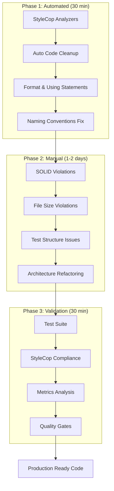
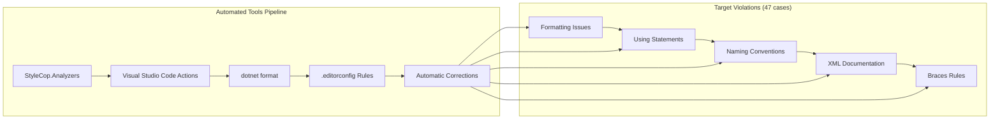
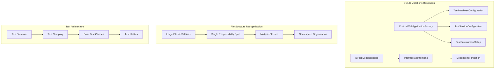
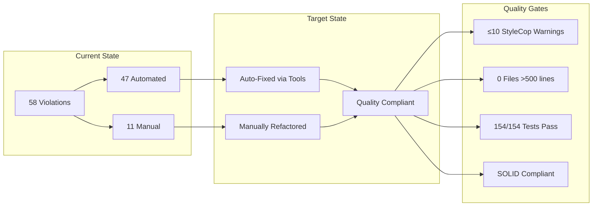
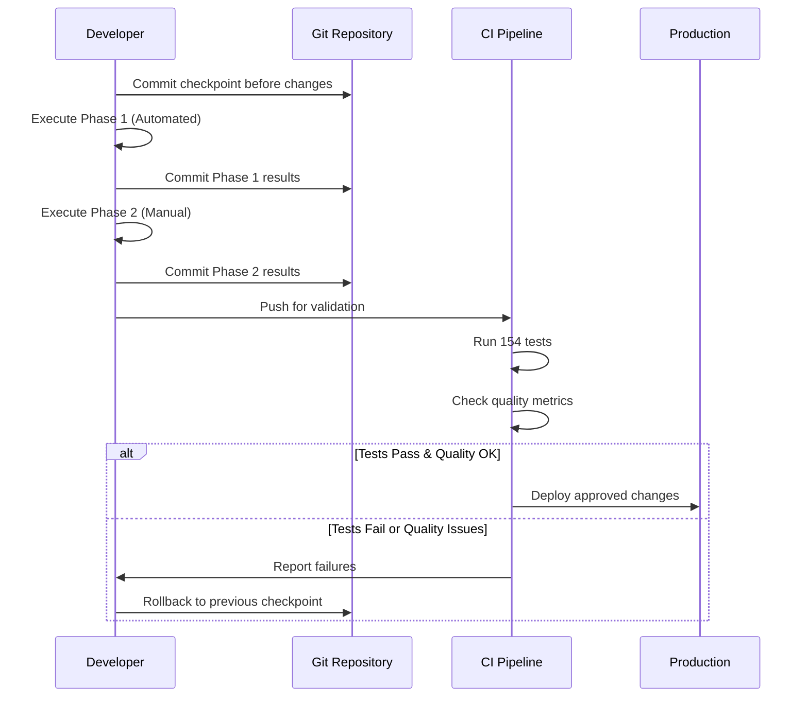

# HYBRID-CODE-QUALITY-RECOVERY-PLAN - Архитектурная диаграмма

## Высокоуровневая архитектура решения

## Детализированная архитектура автоматизации

## Архитектура ручных рефакторингов

## Зависимости между фазами плана

### Phase Dependencies
- **Phase 1 → Phase 2**: Автоматическая очистка обеспечивает чистую базу для архитектурных изменений
- **Phase 2 → Phase 3**: Архитектурные исправления требуют валидации через тесты и метрики
- **Phase 3 → Production**: Валидация обеспечивает качественные критерии для продакшена

### Tool Dependencies
- **StyleCop.Analyzers**: Требует Microsoft.CodeAnalysis.Analyzers (уже установлено)
- **dotnet format**: Требует .NET SDK и .editorconfig настройки
- **Visual Studio Code Actions**: Требует IDE интеграции с анализаторами

### Code Dependencies

## Безопасность и откат

## Технологический стек архитектуры

### Инструменты автоматизации
- **StyleCop.Analyzers 1.1.118**: Static code analysis
- **Microsoft.CodeAnalysis.Analyzers**: Roslyn analyzers framework  
- **dotnet format**: Code formatter CLI tool
- **.editorconfig**: IDE-agnostic formatting rules

### Ручные рефакторинги
- **Visual Studio 2022**: IDE для complex refactoring
- **ReSharper** (опционально): Advanced code analysis
- **SonarQube** (опционально): Technical debt tracking

### Валидация и метрики
- **dotnet test**: Test execution framework
- **Code Metrics**: Maintainability index calculation
- **Git**: Version control and rollback capability

## Ожидаемые архитектурные улучшения

### Количественные изменения
- **StyleCop violations**: 47 → ≤10 (80% reduction)
- **Large files**: Unknown → 0 files >500 lines
- **Test structure**: Flat → Hierarchical organization
- **Dependencies**: Concrete → Interface-based

### Качественные улучшения
- **Maintainability**: Improved through SOLID compliance
- **Testability**: Enhanced through proper dependency injection
- **Readability**: Consistent formatting and naming
- **Modularity**: Logical separation of concerns