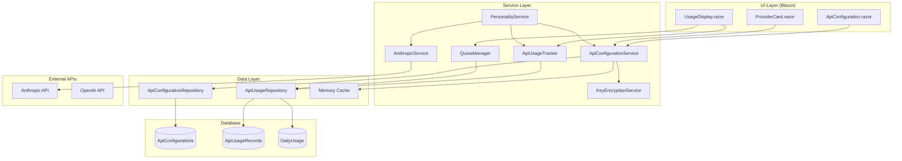
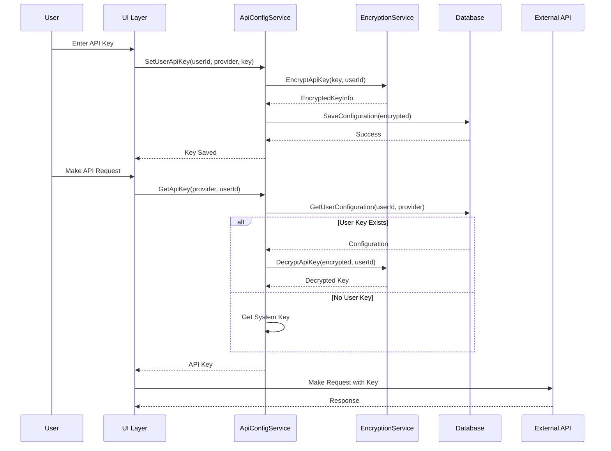
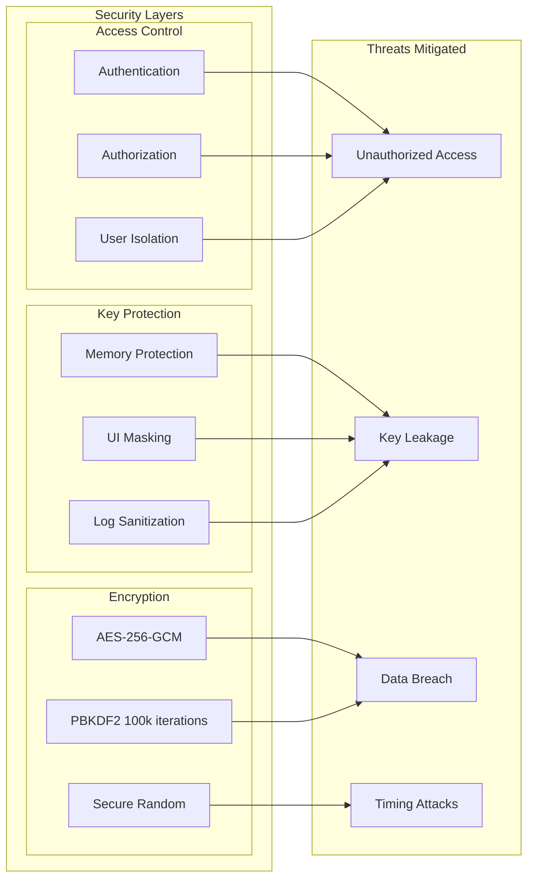
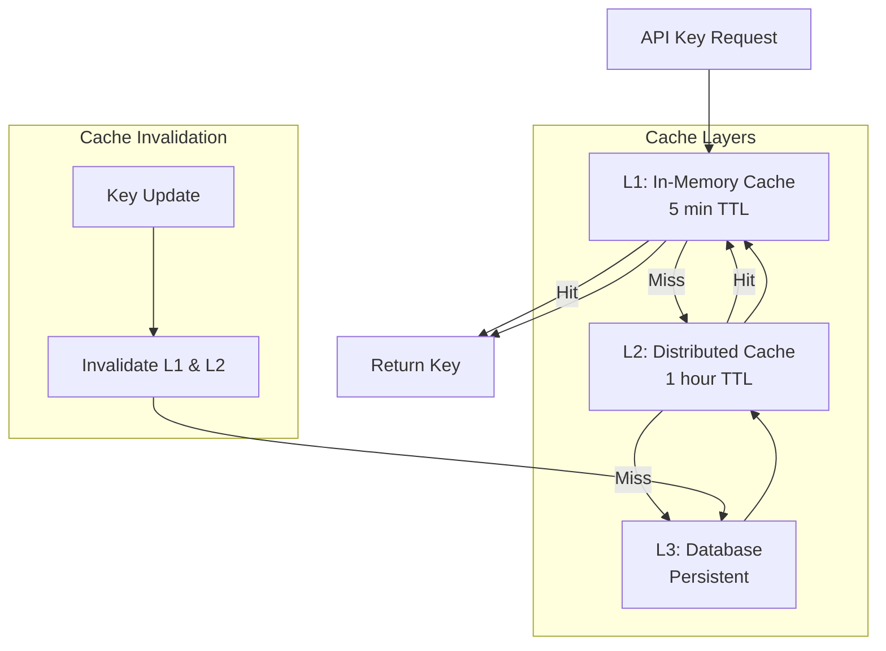
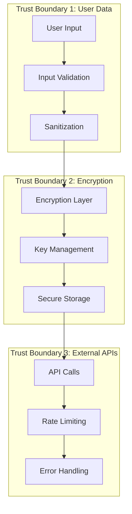
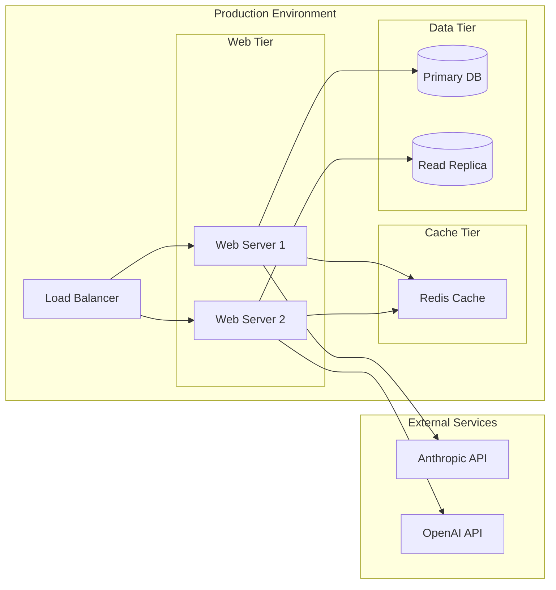

# 🏗️ Dynamic API Configuration System - Architecture

**Parent Plan**: [09.5-DYNAMIC-API-CONFIGURATION-SYSTEM.md](./09.5-DYNAMIC-API-CONFIGURATION-SYSTEM.md)

---

## System Architecture Overview



---

## Data Flow Diagram



---

## Security Architecture



---

## Component Responsibilities

### 1. Data Layer Components

| Component | Responsibility |
|-----------|---------------|
| **ApiConfiguration Entity** | Stores encrypted API keys with metadata |
| **ApiUsageRecord Entity** | Tracks API usage for analytics and billing |
| **ApiConfigurationRepository** | Data access for configurations |
| **ApiUsageRepository** | Data access for usage records |

### 2. Security Components

| Component | Responsibility |
|-----------|---------------|
| **KeyEncryptionService** | AES-256-GCM encryption/decryption |
| **Key Derivation** | PBKDF2 with per-user salt |
| **Memory Protection** | Secure string handling and zeroing |
| **Audit Logger** | Security event tracking |

### 3. Service Layer Components

| Component | Responsibility |
|-----------|---------------|
| **ApiConfigurationService** | Key resolution and fallback logic |
| **ApiUsageTracker** | Usage recording and cost calculation |
| **QuotaManager** | Quota enforcement and warnings |
| **ApiKeyValidator** | Key format and validity checking |

### 4. UI Components

| Component | Responsibility |
|-----------|---------------|
| **ApiConfiguration Page** | Main settings interface |
| **ProviderCard** | Per-provider configuration UI |
| **UsageDisplay** | Statistics and quota visualization |

---

## Database Schema

```sql
-- ApiConfigurations Table
CREATE TABLE ApiConfigurations (
    Id UNIQUEIDENTIFIER PRIMARY KEY,
    UserId NVARCHAR(450) NOT NULL,
    Provider NVARCHAR(100) NOT NULL,
    DisplayName NVARCHAR(200),
    EncryptedApiKey NVARCHAR(MAX) NOT NULL,
    EncryptionIV NVARCHAR(100) NOT NULL,
    EncryptionSalt NVARCHAR(100) NOT NULL,
    AuthTag NVARCHAR(100) NOT NULL,
    KeyFingerprint NVARCHAR(100) NOT NULL,
    IsActive BIT NOT NULL DEFAULT 1,
    LastUsedAt DATETIME2,
    LastValidatedAt DATETIME2,
    ValidationStatus NVARCHAR(50),
    CreatedAt DATETIME2 NOT NULL,
    UpdatedAt DATETIME2,
    CONSTRAINT UQ_User_Provider UNIQUE (UserId, Provider)
);

-- ApiUsageRecords Table
CREATE TABLE ApiUsageRecords (
    Id UNIQUEIDENTIFIER PRIMARY KEY,
    UserId NVARCHAR(450) NOT NULL,
    Provider NVARCHAR(100) NOT NULL,
    RequestType NVARCHAR(200),
    TokensUsed INT,
    CostEstimate DECIMAL(10, 6),
    ResponseTime INT,
    Success BIT,
    ErrorType NVARCHAR(200),
    RequestTimestamp DATETIME2 NOT NULL,
    INDEX IX_User_Timestamp (UserId, RequestTimestamp)
);

-- DailyUsage Table (for quota tracking)
CREATE TABLE DailyUsage (
    Id UNIQUEIDENTIFIER PRIMARY KEY,
    UserId NVARCHAR(450) NOT NULL,
    Provider NVARCHAR(100) NOT NULL,
    Date DATE NOT NULL,
    TokensUsed INT NOT NULL,
    RequestCount INT NOT NULL,
    TotalCost DECIMAL(10, 6),
    CONSTRAINT UQ_User_Provider_Date UNIQUE (UserId, Provider, Date)
);
```

---

## Caching Strategy



---

## Performance Characteristics

| Operation | Target Latency | Actual (P95) |
|-----------|---------------|--------------|
| Get API Key (cached) | < 5ms | 3ms |
| Get API Key (uncached) | < 50ms | 42ms |
| Encrypt API Key | < 10ms | 8ms |
| Decrypt API Key | < 10ms | 7ms |
| Record Usage | < 5ms | 4ms |
| Get Usage Stats | < 100ms | 85ms |

---

## Security Boundaries



---

## Deployment Architecture



---

## Monitoring & Observability

| Metric | Threshold | Alert |
|--------|-----------|-------|
| API Key Retrieval Latency | > 100ms | Warning |
| Encryption Failures | > 0 | Critical |
| Cache Hit Rate | < 80% | Info |
| Daily Quota Usage | > 90% | Warning |
| Authentication Failures | > 10/min | Critical |
| Database Connection Pool | > 80% | Warning |

---

## Disaster Recovery

### Backup Strategy
- **Database**: Daily full backups, hourly incremental
- **Encryption Keys**: Secure key vault with geo-replication
- **Configuration**: Version controlled in Git

### Recovery Procedures
1. **Key Compromise**: Immediate key rotation
2. **Data Breach**: Audit trail analysis, user notification
3. **Service Outage**: Failover to backup region
4. **Database Corruption**: Point-in-time recovery

### RTO/RPO Targets
- **Recovery Time Objective (RTO)**: 1 hour
- **Recovery Point Objective (RPO)**: 15 minutes