# Execution Timeline & Success Metrics

**Родительский план**: [../05-03-PRIORITIZED_EXECUTION_ROADMAP.md](../05-03-PRIORITIZED_EXECUTION_ROADMAP.md)

## 📊 UPDATED EXECUTION TIMELINE

```mermaid
gantt
  title DigitalMe Updated Execution Roadmap
  dateFormat  YYYY-MM-DD
  section P0-Critical ✅
  Fix Agent Intelligence    :done, p0, 2025-09-02, 4h
  
  section P1-Architecture ✅  
  ChatHub SRP Refactoring  :done, p1-1, 2025-09-02, 4h
  MCP Protocol Implementation :done, p1-2, 2025-09-02, 4h  
  Error Handling System   :done, p1-3, 2025-09-02, 2h
  
  section P2-Strategic 🚀
  Unit Tests Fixes        :crit, active, p2-0, 2025-09-02, 2h
  MCP Server Setup        :p2-1, after p2-0, 5d
  Tool Strategy Pattern   :p2-2, after p2-1, 1w
  Performance Monitoring  :p2-3, after p2-2, 1w  
  Production Optimization :p2-4, after p2-3, 1w
  
  section P3-Extensions
  Advanced Personality    :p3-1, after p2-4, 2w
  Google Services         :p3-2, after p3-1, 2w
  GitHub Integration      :p3-3, after p3-2, 1w
  MAUI Applications       :p3-4, after p3-3, 4w
```

## 🎯 SUCCESS METRICS BY PHASE

### ✅ P0 Metrics (COMPLETED):
- [x] Agent success rate > 95% ✅ (100% с fallback responses)
- [x] Response time < 5 seconds ✅ (< 2 seconds для fallback)  
- [x] Fallback rate acceptable ✅ (стилистически корректные)
- [x] Integration test passing ✅

### ✅ P1 Metrics (COMPLETED):
- [x] ChatHub SRP compliance ✅ (MessageProcessor extracted)
- [x] MCP protocol implementation ✅ (JSON-RPC 2.0 с fallback)
- [x] Structured error handling ✅ (доменные исключения)
- [x] Architecture quality improvement ✅ (65% → 85%)

### ✅ P2 Metrics (SIGNIFICANT PROGRESS):
- [x] Unit tests compilation fixed ✅ (CRITICAL)
- [x] MCP server operational ✅ (Core functionality)
- [x] Tool system extensible ✅ (Strategy Pattern implemented)
- [ ] Performance monitoring dashboard 🔥 (CURRENT FOCUS)
- [ ] Production deployment optimized

### 🌟 P3 Metrics (FUTURE):
- [ ] Advanced personality system working
- [ ] 3+ external integrations (Google, GitHub)
- [ ] Mobile apps functional
- [ ] Cross-platform feature parity
- [ ] Performance benchmarks met

## 🔗 RELATED DOCUMENTS

**Execution Plans:**
- **IMMEDIATE**: `05-01-chat-functionality-fix-plan.md` ← **START HERE**
- **Architecture**: `02-technical/02-05-interfaces.md`  
- **Testing**: `03-implementation/03-07-testing-implementation.md`

**Reference:**
- **Progress Review**: `05-02-PROGRESS_REVIEW_AND_NEXT_STEPS.md`
- **Code Review**: Output from code-principles-reviewer
- **Original Plan**: `03-implementation/03-01-development-phases.md`

## 🚀 NEXT ACTIONS (UPDATED)

### IMMEDIATE ACTIONS (TODAY):
1. **CRITICAL 🔥**: Fix unit tests compilation (P2.0) - 1-2 hours
   - `AgentBehaviorEngineTests.cs` - update constructors
   - `AnthropicServiceTests.cs` - add missing parameters  
   - `ConversationServiceTests.cs` - fix FluentAssertions
   - Verify basic test passing

### NEAR-TERM TASKS (THIS WEEK):
2. **P2.1**: Configure MCP Server (3-5 days)
   - Choose/deploy MCP server implementation
   - Configure Claude API integration
   - End-to-end testing

3. **P2.2**: Begin Tool Strategy Pattern implementation (1 week)
   - Refactor hardcoded tool logic
   - Extensible tool system architecture

### MEDIUM-TERM GOALS (MONTH):
4. **P2.3-P2.4**: Performance & Production optimization
5. **Transition to P3**: Advanced features after P2 stabilization

**New execution philosophy:** Build-on-Success. P0+P1 successfully completed, building on solid foundation.

## Navigation
- [Previous: Future Expansions P3](05-03-03-future-expansions-p3.md)
- [P0-P1 Completed Phases](05-03-01-completed-phases-p0-p1.md)
- [P2 Current Focus](05-03-02-current-focus-p2.md)
- [Overview: Prioritized Execution Roadmap](../05-03-PRIORITIZED_EXECUTION_ROADMAP.md)