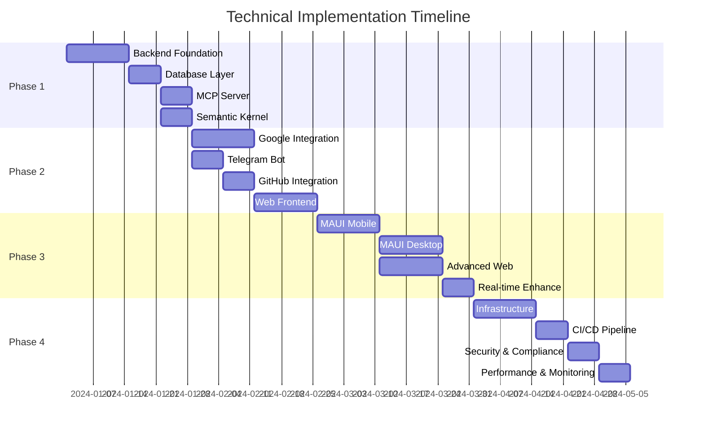

# Technical Implementation Plan - DigitalMe Platform

## Executive Summary

This plan outlines the complete technical implementation of the DigitalMe platform - a multi-frontend personal agent system built on .NET 8 with MCP protocol integration. The system provides a centralized backend orchestrating multiple client interfaces: Blazor Web, MAUI Mobile/Desktop, and Telegram Bot, all integrated with external services like Google Calendar, GitHub, and LLM providers.

**Timeline:** 16 weeks  
**Architecture:** Multi-Frontend + Centralized Backend  
**Technology Stack:** .NET 8, MCP Protocol, PostgreSQL, Azure Cloud  
**Success Criteria:** Fully functional technical platform with all integrations working correctly  

## 1. Technical Architecture Overview

### 1.1 System Architecture

```
┌─────────────────────────────────────────────────────────────────┐
│                    Frontend Layer                               │
├─────────────────────────────────────────────────────────────────┤
│  ┌─────────────┐  ┌─────────────┐  ┌─────────────┐  ┌──────────┐ │
│  │ Blazor Web  │  │ MAUI Mobile │  │ MAUI Desktop│  │ Telegram │ │
│  │ Application │  │ Application │  │ Application │  │    Bot   │ │
│  └─────────────┘  └─────────────┘  └─────────────┘  └──────────┘ │
└─────────────────────────────────────────────────────────────────┘
                              │
                        REST API / SignalR
                              │
┌─────────────────────────────────────────────────────────────────┐
│                Orchestration Layer                             │
├─────────────────────────────────────────────────────────────────┤
│            .NET 8 Web API Backend (Central Hub)                │
│  • Request Router & Intent Analysis                            │
│  • Authentication & Authorization                              │
│  • Real-time Communication (SignalR)                          │
│  • External API Management                                     │
└─────────────────────────────────────────────────────────────────┘
                              │
                         MCP Protocol
                              │
┌─────────────────────────────────────────────────────────────────┐
│                Intelligence Layer                              │
├─────────────────────────────────────────────────────────────────┤
│  ┌─────────────────┐              ┌─────────────────┐           │
│  │  MCP Server     │              │ Semantic Kernel │           │
│  │  (.NET 8)       │◄────────────►│   Integration   │           │
│  │                 │              │                 │           │
│  │ • Tools         │              │ • LLM Providers │           │
│  │ • Resources     │              │ • Plugin System │           │
│  │ • Claude Code   │              │ • Reasoning     │           │
│  └─────────────────┘              └─────────────────┘           │
└─────────────────────────────────────────────────────────────────┘
                              │
┌─────────────────────────────────────────────────────────────────┐
│                    Data Layer                                  │
├─────────────────────────────────────────────────────────────────┤
│  ┌─────────────────┐              ┌─────────────────┐           │
│  │   PostgreSQL    │              │   Redis Cache   │           │
│  │   (Supabase)    │              │                 │           │
│  │                 │              │ • Session Store │           │
│  │ • User Data     │              │ • Caching       │           │
│  │ • Conversations │              │ • Pub/Sub       │           │
│  │ • Tasks         │              │                 │           │
│  │ • Calendar      │              │                 │           │
│  └─────────────────┘              └─────────────────┘           │
└─────────────────────────────────────────────────────────────────┘
                              │
┌─────────────────────────────────────────────────────────────────┐
│                External Services                               │
├─────────────────────────────────────────────────────────────────┤
│  ┌─────────────┐  ┌─────────────┐  ┌─────────────┐  ┌──────────┐ │
│  │Google APIs  │  │ GitHub API  │  │ Telegram    │  │   LLM    │ │
│  │• Calendar   │  │• Repos      │  │ Bot API     │  │Providers │ │
│  │• Drive      │  │• Issues     │  │             │  │• OpenAI  │ │
│  │• Contacts   │  │• Actions    │  │             │  │• Claude  │ │
│  └─────────────┘  └─────────────┘  └─────────────┘  └──────────┘ │
└─────────────────────────────────────────────────────────────────┘
```

### 1.2 Technology Stack

**Core Platform:**
- .NET 8.0 - Primary development platform
- ASP.NET Core Web API - Backend services
- Entity Framework Core 8.0 - Data access layer
- C# 12 - Programming language

**Frontend Technologies:**
- Blazor Server/WASM - Web application
- MAUI - Cross-platform mobile/desktop apps
- Telegram Bot API - Chat interface

**Intelligence & Orchestration:**
- Microsoft Semantic Kernel - AI orchestration framework
- Model Context Protocol (MCP) - Claude Code integration
- OpenAI & Anthropic APIs - LLM providers

**Data & Infrastructure:**
- PostgreSQL 15+ - Primary database
- Redis - Caching and session storage
- Azure Container Apps - Hosting platform
- Supabase - Database hosting

## 2. Implementation Phases

The implementation is structured in four comprehensive phases, each building upon the previous phase's deliverables. Detailed documentation for each phase is available in the corresponding catalog files:

### Phase 1: Core Backend Infrastructure (Weeks 1-4)
**Objective:** Build the central orchestration platform with basic integrations  
**Detailed Plan:** [01-PHASE1_BACKEND_INFRASTRUCTURE.md](./00-TECHNICAL_IMPLEMENTATION_PLAN/01-PHASE1_BACKEND_INFRASTRUCTURE.md)

**Key Components:**
- .NET 8 Web API foundation with dependency injection
- PostgreSQL database with Entity Framework Core
- MCP Server implementation for Claude Code integration
- Semantic Kernel setup with multiple LLM providers

**Major Deliverables:**
- Running ASP.NET Core API with health endpoints
- Complete database schema with migrations
- Functional MCP server with core tools
- Semantic Kernel plugins for calendar and tasks

### Phase 2: Core Integrations (Weeks 5-8)
**Objective:** Implement external service integrations and basic frontend interfaces  
**Detailed Plan:** [02-PHASE2_CORE_INTEGRATIONS.md](./00-TECHNICAL_IMPLEMENTATION_PLAN/02-PHASE2_CORE_INTEGRATIONS.md)

**Key Components:**
- Google Services integration (Calendar, Drive, Contacts)
- Telegram Bot with natural language processing
- GitHub API integration for repository management
- Blazor web application with real-time updates

**Major Deliverables:**
- Bidirectional Google Calendar synchronization
- Fully functional Telegram bot with commands
- GitHub integration with issue tracking
- Web dashboard with SignalR real-time updates

### Phase 3: Advanced Frontend Development (Weeks 9-12)
**Objective:** Complete multi-frontend architecture with MAUI applications and advanced features  
**Detailed Plan:** [03-PHASE3_ADVANCED_FRONTEND.md](./00-TECHNICAL_IMPLEMENTATION_PLAN/03-PHASE3_ADVANCED_FRONTEND.md)

**Key Components:**
- .NET MAUI mobile application for iOS and Android
- .NET MAUI desktop application for Windows and macOS
- Advanced web features with analytics dashboard
- Enhanced real-time communication system

**Major Deliverables:**
- Native mobile apps with push notifications
- Desktop apps with system tray integration
- Advanced calendar and task management
- Comprehensive analytics dashboard

### Phase 4: Production Deployment & Optimization (Weeks 13-16)
**Objective:** Deploy to production and optimize for scale, performance, and operational excellence  
**Detailed Plan:** [04-PHASE4_PRODUCTION_DEPLOYMENT.md](./00-TECHNICAL_IMPLEMENTATION_PLAN/04-PHASE4_PRODUCTION_DEPLOYMENT.md)

**Key Components:**
- Azure infrastructure setup with Container Apps
- CI/CD pipeline with blue-green deployment
- Security hardening and GDPR compliance
- Performance optimization and monitoring

**Major Deliverables:**
- Production Azure environment with auto-scaling
- Automated deployment pipeline with quality gates
- Comprehensive security and compliance measures
- Performance-optimized system with monitoring

## Phase Dependencies and Critical Path



## 3. Technical Specifications

### 3.1 API Design

**REST API Endpoints:**
```
GET    /api/v1/users/profile          - Get user profile
POST   /api/v1/auth/login             - User authentication
GET    /api/v1/calendar/events        - Get calendar events
POST   /api/v1/calendar/events        - Create calendar event
GET    /api/v1/tasks                  - Get user tasks
POST   /api/v1/tasks                  - Create task
PUT    /api/v1/tasks/{id}             - Update task
DELETE /api/v1/tasks/{id}             - Delete task
POST   /api/v1/chat/message           - Send chat message
GET    /api/v1/integrations           - Get user integrations
POST   /api/v1/integrations/{service} - Setup service integration
```

**SignalR Hubs:**
```csharp
public class AgentHub : Hub
{
    public async Task JoinUserGroup(string userId)
    public async Task SendQuickMessage(string message)
    public async Task NotifyTaskUpdate(string taskId)
    public async Task NotifyCalendarUpdate(string eventId)
}
```

### 3.2 Database Schema

**Core Entities:**
- Users (authentication and profile data)
- AgentSessions (conversation sessions)
- Tasks (user tasks and reminders)
- CalendarEvents (cached calendar data)
- UserIntegrations (external service connections)
- ConversationHistory (chat history)
- Notifications (system notifications)

**Indexes and Performance:**
```sql
-- Performance indexes
CREATE INDEX idx_users_telegram_id ON Users(TelegramUserId);
CREATE INDEX idx_tasks_user_status ON Tasks(UserId, Status);
CREATE INDEX idx_calendar_events_user_date ON CalendarEvents(UserId, StartTime);
CREATE INDEX idx_sessions_user_active ON AgentSessions(UserId, Status);
```

### 3.3 Integration Patterns

**External API Integration:**
```csharp
public interface IExternalApiService<T>
{
    Task<T> GetAsync(string endpoint);
    Task<T> PostAsync<TRequest>(string endpoint, TRequest data);
    Task<T> PutAsync<TRequest>(string endpoint, TRequest data);
    Task<bool> DeleteAsync(string endpoint);
}
```

**Retry and Circuit Breaker Pattern:**
```csharp
services.AddHttpClient<IGoogleCalendarService, GoogleCalendarService>()
    .AddPolicyHandler(GetRetryPolicy())
    .AddPolicyHandler(GetCircuitBreakerPolicy());
```

## 4. Resource Requirements

### 4.1 Development Resources

**Team Structure:**
- 1x Senior .NET Developer (Full-time, 16 weeks)
- 1x Frontend Developer (Part-time, 8 weeks)
- 1x DevOps Engineer (Part-time, 4 weeks)

**Development Environment:**
- Visual Studio 2022 Professional
- Azure DevOps or GitHub Pro
- Docker Desktop
- Postman or similar API testing tool

### 4.2 Infrastructure Costs (Monthly)

| Service | Estimated Cost | Purpose |
|---------|---------------|---------|
| Azure Container Apps | $30-80 | API hosting with scale-to-zero |
| Supabase Pro | $25 | PostgreSQL database |
| Azure Redis Cache | $15-30 | Caching and session storage |
| Azure Key Vault | $3-5 | Secrets management |
| Application Insights | $10-20 | Monitoring and analytics |
| OpenAI API | $50-150 | LLM processing |
| Anthropic API | $50-150 | Alternative LLM |
| GitHub Actions | $0-50 | CI/CD pipeline |
| **Total** | **$183-510** | **Variable based on usage** |

### 4.3 External Service Dependencies

**Required API Keys:**
- OpenAI API key for GPT models
- Anthropic API key for Claude models
- Telegram Bot Token
- Google Cloud Console project with Calendar/Drive APIs
- GitHub Personal Access Token

**Service Quotas:**
- Google Calendar API: 1,000,000 requests/day (free tier)
- Telegram Bot API: No rate limits for basic operations
- OpenAI API: Pay-per-use, ~$0.01-0.06 per 1K tokens
- GitHub API: 5,000 requests/hour (authenticated)

## 5. Success Criteria & Testing

### 5.1 Technical Success Metrics

**Platform Performance:**
- API response time < 500ms (95th percentile)
- Database query response < 100ms average
- Frontend load time < 3 seconds
- MCP protocol response < 1 second
- 99.9% uptime availability

**Integration Success:**
- Google Calendar sync working correctly
- Telegram bot responds to all message types
- GitHub integration creates/updates issues
- MCP server communicates with Claude Code
- All frontends sync data in real-time

**Security Compliance:**
- All API endpoints properly authenticated
- Sensitive data encrypted at rest
- API rate limiting functional
- HTTPS enforced across all services
- Audit logging captures all critical actions

### 5.2 Integration Testing

**API Testing:**
```csharp
[Test]
public async Task CreateTask_ValidRequest_ReturnsTaskId()
{
    var request = new CreateTaskRequest 
    { 
        Title = "Test Task",
        DueDate = DateTime.Now.AddDays(1)
    };
    
    var response = await _apiClient.PostAsync("/api/v1/tasks", request);
    
    Assert.That(response.IsSuccessStatusCode, Is.True);
    var task = await response.Content.ReadFromJsonAsync<TaskResponse>();
    Assert.That(task.Id, Is.Not.EqualTo(Guid.Empty));
}
```

**MCP Server Testing:**
```csharp
[Test]
public async Task MCPServer_GetCalendarEvents_ReturnsEvents()
{
    var mcpClient = new MCPClient("http://localhost:8080/mcp");
    var events = await mcpClient.CallToolAsync<CalendarEvent[]>(
        "get_user_calendar", 
        new { start = DateTime.Today, end = DateTime.Today.AddDays(7) });
    
    Assert.That(events, Is.Not.Null);
}
```

### 5.3 End-to-End Testing

**User Scenarios:**
1. User registers through Telegram bot
2. User connects Google Calendar integration
3. User creates task via web interface
4. Task appears in mobile app in real-time
5. Calendar event created through Claude Code MCP
6. Notification sent to all user devices

## 6. Risk Mitigation

### 6.1 Technical Risks

**Risk: MCP Protocol Instability**
- Mitigation: Use stable MCP SDK version, implement abstraction layer
- Contingency: Direct HTTP implementation if SDK fails

**Risk: Multi-Frontend State Synchronization**
- Mitigation: Event-driven architecture with SignalR
- Contingency: Polling fallback for real-time updates

**Risk: External API Rate Limiting**
- Mitigation: Implement caching and request batching
- Contingency: Graceful degradation with user notifications

**Risk: Scale-to-Zero Cold Starts**
- Mitigation: Health check warming, minimum replica configuration
- Contingency: Always-on hosting tier for critical components

### 6.2 Implementation Risks

**Risk: Integration Complexity**
- Mitigation: Phased implementation, thorough testing
- Contingency: Reduce scope to core integrations only

**Risk: Development Timeline Overrun**
- Mitigation: Agile methodology, weekly checkpoints
- Contingency: Phase prioritization, feature deferral

## 7. Next Steps

### 7.1 Immediate Actions (Week 1)

1. Set up development environment
2. Create Azure subscription and resource groups
3. Obtain all required API keys and tokens
4. Set up Supabase PostgreSQL instance
5. Initialize .NET solution structure

### 7.2 Critical Path Dependencies

1. MCP Server → Claude Code Integration
2. Backend API → All Frontend Development
3. Authentication → External Service Integrations
4. Database Schema → Entity Framework Models
5. CI/CD Pipeline → Production Deployment

### 7.3 Risk Monitoring

- Weekly technical review meetings
- Continuous integration health monitoring
- External API quota tracking
- Performance baseline establishment
- Security vulnerability scanning

---

## Conclusion

This technical implementation plan provides a comprehensive roadmap for building the DigitalMe platform with a focus on solid architecture, scalable infrastructure, and reliable integrations. The phased approach ensures steady progress while maintaining system stability and quality.

The plan prioritizes core functionality first, then expands to advanced features, ensuring a working system is available early in the development cycle. The multi-frontend architecture provides flexibility for different user scenarios while maintaining a centralized data model and business logic.

**The work plan is now ready for review. I recommend invoking the work-plan-reviewer agent to validate this plan against quality standards, ensure LLM execution readiness, and verify completeness before proceeding with implementation.**