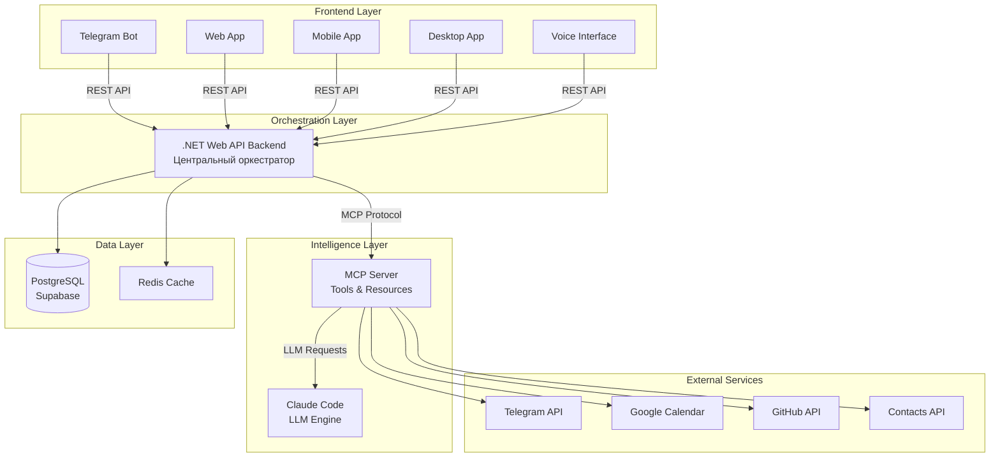

# Multi-Frontend персонального агента Ивана - Техническая архитектура

## Обзор концепции

Переработанная архитектура персонального агента Ивана основана на принципе **Multi-Frontend + Centralized Backend**, где:

- **Custom Backend** (.NET Web API) выступает центральным оркестратором 
- **Claude Code** используется как LLM engine через MCP протокол
- **Multiple Frontends** обеспечивают разные способы взаимодействия

## 1. Высокоуровневая архитектура



## 2. Архитектурные принципы

### 2.1 Separation of Concerns

**Frontend Layer** - только UI и user experience:
- Отображение данных
- Сбор пользовательского ввода
- Локальное кэширование UI состояний
- Push notifications

**Backend Layer** - business logic и orchestration:
- Анализ намерений пользователя
- Выбор подходящих инструментов
- Управление контекстом и памятью
- Координация внешних интеграций

**Intelligence Layer** - reasoning и decision making:
- Natural language processing
- Сложная логика и планирование 
- Tool orchestration
- Context-aware responses

### 2.2 Unified Experience

**Единый контекст между интерфейсами:**
- Начатый в Telegram разговор продолжается в Web App
- Созданные задачи синхронизируются везде
- Персональные настройки применяются во всех клиентах

**Adaptive UI:**
- Telegram - краткие команды и quick actions
- Web App - rich interface для управления
- Mobile - touch-optimized workflow
- Voice - hands-free операции

## 3. Компонентная архитектура

### 3.1 Custom Backend (.NET Web API)

**Роль:** Центральный оркестратор системы

**Ответственности:**
```
┌─────────────────────────────────────┐
│         .NET Backend API            │
├─────────────────────────────────────┤
│ • Request Router & Dispatcher       │
│ • Intent Analysis & Classification  │
│ • Context & Memory Management       │
│ • Authentication & Authorization    │
│ • Rate Limiting & Caching          │
│ • Real-time notifications (SignalR)│
│ • Audit Logging & Analytics        │
│ • External API Management          │
└─────────────────────────────────────┘
```

**Технический стек:**
- **.NET 8.0** - основная платформа
- **ASP.NET Core Web API** - REST API endpoints
- **Entity Framework Core** - data access
- **SignalR** - real-time communication
- **StackExchange.Redis** - caching и sessions
- **MassTransit** - message queue для async operations

### 3.2 Claude Code Integration (MCP)

**Роль:** LLM Engine для сложной логики

**Ответственности:**
```
┌─────────────────────────────────────┐
│        Claude Code + MCP            │
├─────────────────────────────────────┤
│ • Natural Language Understanding    │
│ • Complex Reasoning & Planning      │
│ • Code Generation & Analysis        │
│ • Technical Decision Making         │
│ • Multi-step workflow execution     │
│ • Context-aware responses           │
└─────────────────────────────────────┘
```

**MCP Tools предоставляемые Backend:**
- `get_user_context` - текущий контекст пользователя
- `execute_calendar_action` - операции с календарем
- `send_message` - отправка сообщений через любой канал  
- `manage_tasks` - создание и управление задачами
- `search_conversations` - поиск по истории разговоров

### 3.3 Frontend Components

#### 3.3.1 Telegram Bot

**Специализация:** Quick actions и notifications

**Возможности:**
- Текстовые команды и natural language input
- Voice message transcription
- Quick replies и inline keyboards
- Push notifications о важных событиях
- File sharing (documents, images)

**Технический стек:**
- Telegram Bot API через Backend
- Webhook integration
- Voice-to-text через Azure Speech Services

#### 3.3.2 Web Application

**Специализация:** Rich management interface

**Возможности:**
- Dashboard с аналитикой и overview
- Detailed task и calendar management
- Conversation history browser
- Settings и integrations management
- Bulk operations на данных

**Технический стек:**
- **React 18** с TypeScript
- **Vite** для bundling
- **Tailwind CSS** для styling
- **React Query** для state management
- **Socket.io** для real-time updates

#### 3.3.3 Mobile Application

**Специализация:** On-the-go productivity

**Возможности:**
- Native push notifications
- Quick voice input
- Location-based reminders
- Offline capability для basic operations
- Camera integration для document scanning

**Технический стек:**
- **React Native** для cross-platform
- **Expo** для rapid development
- **Async Storage** для offline data
- **React Navigation** для routing

#### 3.3.4 Desktop Integration

**Специализация:** Workflow integration

**Возможности:**
- System tray integration
- Global hotkeys для quick actions
- Desktop notifications
- File system integration
- IDE plugins (VS Code, JetBrains)

**Технический стек:**
- **Electron** для desktop wrapper
- **Native modules** для system integration
- **Auto-updater** для seamless updates

#### 3.3.5 Voice Interface

**Специализация:** Hands-free operations

**Возможности:**
- Voice commands recognition
- Text-to-speech responses
- Smart home integration (Alexa, Google Home)
- Car integration через Android Auto/CarPlay

**Технический стек:**
- **Azure Speech Services** для STT/TTS
- **Custom wake word** detection
- **WebRTC** для real-time audio streaming

## 4. API Design & Contracts

### 4.1 REST API Contracts

**Base URL:** `https://ivan-agent-api.azurecontainerapps.io/api/v1`

#### Core Conversation API
```typescript
// POST /conversation/message
interface SendMessageRequest {
  message: string;
  context?: ConversationContext;
  source: 'telegram' | 'web' | 'mobile' | 'voice' | 'desktop';
  attachments?: FileAttachment[];
}

interface SendMessageResponse {
  responseId: string;
  message: string;
  actions?: AgentAction[];
  context: ConversationContext;
  suggestions?: string[];
}
```

#### Task Management API  
```typescript
// GET /tasks
interface Task {
  id: string;
  title: string;
  description?: string;
  status: 'pending' | 'in_progress' | 'completed' | 'cancelled';
  priority: 'low' | 'medium' | 'high' | 'urgent';
  dueDate?: Date;
  tags: string[];
  createdAt: Date;
  updatedAt: Date;
}

// POST /tasks
interface CreateTaskRequest {
  title: string;
  description?: string;
  dueDate?: Date;
  priority?: TaskPriority;
  autoSchedule?: boolean;
}
```

#### Calendar Integration API
```typescript
// GET /calendar/events
interface CalendarEvent {
  id: string;
  title: string;
  description?: string;
  start: Date;
  end: Date;
  location?: string;
  attendees: string[];
  source: 'google' | 'outlook' | 'manual';
}

// POST /calendar/events/smart-create
interface SmartCreateEventRequest {
  naturalLanguageDescription: string;
  // Пример: "Встреча с командой завтра в 15:00 на час"
}
```

#### Context & Memory API
```typescript
// GET /context/current
interface UserContext {
  userId: string;
  currentLocation?: string;
  timeZone: string;
  workingHours: TimeRange;
  currentProjects: Project[];
  recentConversations: ConversationSummary[];
  preferredLanguage: string;
}

// POST /memory/save
interface SaveMemoryRequest {
  conversationId: string;
  keyPoints: string[];
  importance: 1 | 2 | 3 | 4 | 5;
  tags: string[];
}
```

### 4.2 Real-time Communication (SignalR)

**Hub:** `/hub/agent`

**Events:**
```typescript
// Server -> Client events
interface AgentHubEvents {
  'TaskUpdated': (task: Task) => void;
  'NewNotification': (notification: Notification) => void;
  'CalendarEventReminder': (event: CalendarEvent) => void;
  'SystemStatus': (status: SystemStatus) => void;
}

// Client -> Server methods
interface AgentHubMethods {
  'JoinUserGroup': (userId: string) => Promise<void>;
  'SendQuickMessage': (message: string) => Promise<AgentResponse>;
  'AcknowledgeNotification': (notificationId: string) => Promise<void>;
}
```

### 4.3 MCP Integration Contracts

**MCP Server Endpoint:** `https://ivan-mcp.azurecontainerapps.io`

**Resources provided to Claude:**
```typescript
interface PersonalityResource {
  uri: "personality://profile";
  name: "Профиль личности Ивана";
  data: {
    identity: UserIdentity;
    personality: PersonalityTraits;
    preferences: UserPreferences;
    currentContext: ContextSnapshot;
  }
}

interface ConversationHistoryResource {
  uri: "conversations://history";
  name: "История разговоров";  
  data: ConversationSummary[];
}
```

**Tools available to Claude:**
```typescript
interface MCPTools {
  'execute_calendar_action': (action: CalendarAction) => Promise<Result>;
  'send_notification': (message: string, channel: Channel) => Promise<Result>;
  'create_task': (task: CreateTaskRequest) => Promise<Task>;
  'search_information': (query: string, sources: Source[]) => Promise<SearchResult>;
  'analyze_context': (context: any) => Promise<ContextAnalysis>;
}
```

## 5. Data Architecture

### 5.1 Database Schema

**PostgreSQL на Supabase** - основное хранилище

```sql
-- Пользователи и аутентификация
CREATE TABLE users (
    id UUID PRIMARY KEY DEFAULT gen_random_uuid(),
    telegram_user_id BIGINT UNIQUE,
    email VARCHAR(255),
    full_name VARCHAR(200),
    time_zone VARCHAR(50) DEFAULT 'UTC',
    preferred_language VARCHAR(10) DEFAULT 'ru',
    created_at TIMESTAMP WITH TIME ZONE DEFAULT NOW(),
    updated_at TIMESTAMP WITH TIME ZONE DEFAULT NOW()
);

-- Разговоры и сессии
CREATE TABLE conversations (
    id UUID PRIMARY KEY DEFAULT gen_random_uuid(),
    user_id UUID REFERENCES users(id),
    source VARCHAR(20) NOT NULL, -- 'telegram', 'web', 'mobile', etc.
    session_id VARCHAR(100),
    started_at TIMESTAMP WITH TIME ZONE DEFAULT NOW(),
    ended_at TIMESTAMP WITH TIME ZONE,
    context JSONB,
    summary TEXT
);

-- Сообщения в разговорах
CREATE TABLE messages (
    id UUID PRIMARY KEY DEFAULT gen_random_uuid(),
    conversation_id UUID REFERENCES conversations(id),
    role VARCHAR(20) NOT NULL, -- 'user', 'assistant', 'system'
    content TEXT NOT NULL,
    metadata JSONB, -- attachments, reactions, etc.
    created_at TIMESTAMP WITH TIME ZONE DEFAULT NOW()
);

-- Задачи и напоминания
CREATE TABLE tasks (
    id UUID PRIMARY KEY DEFAULT gen_random_uuid(),
    user_id UUID REFERENCES users(id),
    title VARCHAR(500) NOT NULL,
    description TEXT,
    status task_status DEFAULT 'pending',
    priority task_priority DEFAULT 'medium',
    due_date TIMESTAMP WITH TIME ZONE,
    completed_at TIMESTAMP WITH TIME ZONE,
    tags TEXT[],
    metadata JSONB, -- source, automation rules, etc.
    created_at TIMESTAMP WITH TIME ZONE DEFAULT NOW(),
    updated_at TIMESTAMP WITH TIME ZONE DEFAULT NOW()
);

-- События календаря
CREATE TABLE calendar_events (
    id UUID PRIMARY KEY DEFAULT gen_random_uuid(),
    user_id UUID REFERENCES users(id),
    external_id VARCHAR(255), -- Google Calendar event ID
    title VARCHAR(500) NOT NULL,
    description TEXT,
    start_time TIMESTAMP WITH TIME ZONE NOT NULL,
    end_time TIMESTAMP WITH TIME ZONE NOT NULL,
    location VARCHAR(500),
    attendees JSONB,
    source VARCHAR(50), -- 'google', 'manual', 'automated'
    created_at TIMESTAMP WITH TIME ZONE DEFAULT NOW(),
    updated_at TIMESTAMP WITH TIME ZONE DEFAULT NOW()
);

-- Интеграции и настройки
CREATE TABLE user_integrations (
    id UUID PRIMARY KEY DEFAULT gen_random_uuid(),
    user_id UUID REFERENCES users(id),
    service_type VARCHAR(50) NOT NULL,
    configuration JSONB, -- encrypted tokens, settings
    is_active BOOLEAN DEFAULT TRUE,
    last_sync TIMESTAMP WITH TIME ZONE,
    created_at TIMESTAMP WITH TIME ZONE DEFAULT NOW()
);

-- Память и контекст
CREATE TABLE conversation_memory (
    id UUID PRIMARY KEY DEFAULT gen_random_uuid(),
    user_id UUID REFERENCES users(id),
    conversation_id UUID REFERENCES conversations(id),
    topic VARCHAR(500),
    key_points TEXT[],
    importance INTEGER CHECK (importance >= 1 AND importance <= 5),
    tags TEXT[],
    metadata JSONB,
    created_at TIMESTAMP WITH TIME ZONE DEFAULT NOW()
);

-- Паттерны поведения (ML/AI insights)
CREATE TABLE behavior_patterns (
    id UUID PRIMARY KEY DEFAULT gen_random_uuid(),
    user_id UUID REFERENCES users(id),
    pattern_type VARCHAR(50), -- 'response_style', 'schedule_preference', etc.
    conditions JSONB, -- when this pattern applies
    actions JSONB, -- what to do
    confidence DECIMAL(3,2) CHECK (confidence >= 0 AND confidence <= 1),
    usage_count INTEGER DEFAULT 0,
    created_at TIMESTAMP WITH TIME ZONE DEFAULT NOW(),
    updated_at TIMESTAMP WITH TIME ZONE DEFAULT NOW()
);

-- Уведомления
CREATE TABLE notifications (
    id UUID PRIMARY KEY DEFAULT gen_random_uuid(),
    user_id UUID REFERENCES users(id),
    title VARCHAR(200) NOT NULL,
    message TEXT NOT NULL,
    type VARCHAR(50), -- 'task_reminder', 'calendar_event', 'system'
    priority notification_priority DEFAULT 'medium',
    channels TEXT[], -- ['telegram', 'web', 'mobile', 'email']
    sent_at TIMESTAMP WITH TIME ZONE,
    read_at TIMESTAMP WITH TIME ZONE,
    metadata JSONB,
    created_at TIMESTAMP WITH TIME ZONE DEFAULT NOW()
);

-- Енумы
CREATE TYPE task_status AS ENUM ('pending', 'in_progress', 'completed', 'cancelled');
CREATE TYPE task_priority AS ENUM ('low', 'medium', 'high', 'urgent');
CREATE TYPE notification_priority AS ENUM ('low', 'medium', 'high', 'critical');
```

### 5.2 Caching Strategy (Redis)

**Cache Keys Structure:**
```
user:{userId}:context           - текущий контекст пользователя (TTL: 1h)
user:{userId}:preferences       - предпочтения пользователя (TTL: 24h)
conversation:{conversationId}   - активная сессия разговора (TTL: 2h)
calendar:{userId}:events:{date} - события календаря на дату (TTL: 1h)
tasks:{userId}:pending          - активные задачи пользователя (TTL: 30m)
integrations:{userId}:tokens    - зашифрованные токены интеграций (TTL: 1h)
```

**Cache Invalidation:**
- При обновлении пользовательских данных
- При создании/изменении задач и событий
- При завершении разговорных сессий
- При изменении интеграционных настроек

## 6. Технологический стек по компонентам

### 6.1 Backend (.NET Web API)

```xml
<!-- Core framework -->
<PackageReference Include="Microsoft.AspNetCore.App" Version="8.0.0" />
<PackageReference Include="Microsoft.EntityFrameworkCore" Version="8.0.10" />
<PackageReference Include="Npgsql.EntityFrameworkCore.PostgreSQL" Version="8.0.10" />

<!-- Real-time communication -->
<PackageReference Include="Microsoft.AspNetCore.SignalR" Version="8.0.0" />

<!-- Caching -->
<PackageReference Include="StackExchange.Redis" Version="2.8.16" />
<PackageReference Include="Microsoft.Extensions.Caching.StackExchangeRedis" Version="8.0.0" />

<!-- Message Queue -->
<PackageReference Include="MassTransit" Version="8.2.5" />
<PackageReference Include="MassTransit.RabbitMQ" Version="8.2.5" />

<!-- External API integrations -->
<PackageReference Include="Telegram.Bot" Version="22.6.0" />
<PackageReference Include="Google.Apis.Calendar.v3" Version="1.69.0" />
<PackageReference Include="Octokit" Version="13.0.1" />

<!-- MCP Integration -->
<PackageReference Include="ModelContextProtocol" Version="0.3.0-preview.4" />

<!-- Authentication & Security -->
<PackageReference Include="Microsoft.AspNetCore.Authentication.JwtBearer" Version="8.0.0" />
<PackageReference Include="Azure.Identity" Version="1.12.1" />
<PackageReference Include="Azure.Security.KeyVault.Secrets" Version="4.6.0" />

<!-- Monitoring & Logging -->
<PackageReference Include="Microsoft.ApplicationInsights.AspNetCore" Version="2.22.0" />
<PackageReference Include="Serilog.AspNetCore" Version="8.0.2" />

<!-- Voice processing -->
<PackageReference Include="Microsoft.CognitiveServices.Speech" Version="1.38.0" />
```

### 6.2 MCP Server (.NET)

```xml
<PackageReference Include="ModelContextProtocol" Version="0.3.0-preview.4" />
<PackageReference Include="Microsoft.Extensions.Hosting" Version="8.0.0" />
<PackageReference Include="Microsoft.EntityFrameworkCore" Version="8.0.10" />
<PackageReference Include="Npgsql.EntityFrameworkCore.PostgreSQL" Version="8.0.10" />
```

### 6.3 Frontend Technologies

#### Web Application
```json
{
  "dependencies": {
    "react": "^18.3.1",
    "react-dom": "^18.3.1",
    "typescript": "^5.5.0",
    "@tanstack/react-query": "^5.56.2",
    "socket.io-client": "^4.8.0",
    "axios": "^1.7.7",
    "react-router-dom": "^6.26.2",
    "tailwindcss": "^3.4.10",
    "@headlessui/react": "^2.1.8",
    "framer-motion": "^11.5.4",
    "react-hook-form": "^7.53.0",
    "date-fns": "^3.6.0"
  },
  "devDependencies": {
    "vite": "^5.4.7",
    "@vitejs/plugin-react": "^4.3.1",
    "eslint": "^9.10.0",
    "prettier": "^3.3.3"
  }
}
```

#### Mobile Application  
```json
{
  "dependencies": {
    "react-native": "^0.75.3",
    "expo": "~51.0.28",
    "@react-navigation/native": "^6.1.18",
    "@react-navigation/bottom-tabs": "^6.6.1",
    "expo-notifications": "~0.28.15",
    "expo-speech": "~12.0.2",
    "expo-av": "~14.0.7",
    "@react-native-async-storage/async-storage": "1.23.1",
    "react-native-paper": "^5.12.3",
    "react-native-vector-icons": "^10.1.0"
  }
}
```

#### Desktop Application
```json
{
  "dependencies": {
    "electron": "^32.0.1",
    "electron-builder": "^25.0.5",
    "electron-updater": "^6.3.4",
    "react": "^18.3.1",
    "socket.io-client": "^4.8.0"
  }
}
```

## 7. Deployment & Infrastructure

### 7.1 Azure Architecture

```
┌─────────────────────────────────────────────────────────────┐
│                    Azure Resource Group                     │
├─────────────────────────────────────────────────────────────┤
│                                                             │
│ ┌─────────────────┐  ┌─────────────────┐  ┌─────────────────┐ │
│ │ Container Apps  │  │ Container Apps  │  │   Azure Redis   │ │
│ │  Main Backend   │  │   MCP Server    │  │     Cache       │ │
│ │                 │  │                 │  │                 │ │
│ │ • REST API      │  │ • MCP Tools     │  │ • Session Store │ │
│ │ • SignalR Hubs  │  │ • Resources     │  │ • Cache Layer   │ │
│ │ • Auth & Logic  │  │ • Claude Integr │  │ • Pub/Sub       │ │
│ └─────────────────┘  └─────────────────┘  └─────────────────┘ │
│                                                             │
│ ┌─────────────────┐  ┌─────────────────┐  ┌─────────────────┐ │
│ │  Static Web     │  │  Service Bus    │  │   Key Vault     │ │
│ │   Apps (SWA)    │  │                 │  │                 │ │
│ │                 │  │ • Message Queue │  │ • API Keys      │ │
│ │ • React Web App │  │ • Event Stream  │  │ • Certificates  │ │
│ │ • Auto deploy   │  │ • Background    │  │ • Secrets       │ │
│ │ • CDN included  │  │   Jobs          │  │                 │ │
│ └─────────────────┘  └─────────────────┘  └─────────────────┘ │
│                                                             │
│ ┌─────────────────┐  ┌─────────────────┐  ┌─────────────────┐ │
│ │ Application     │  │  Speech Services│  │   App Insights  │ │
│ │   Insights      │  │                 │  │                 │ │
│ │                 │  │ • STT & TTS     │  │ • Monitoring    │ │
│ │ • Monitoring    │  │ • Voice Recog   │  │ • Analytics     │ │
│ │ • Logging       │  │ • Multi-lang    │  │ • Alerts        │ │
│ │ • Analytics     │  │ • Real-time     │  │ • Dashboards    │ │
│ └─────────────────┘  └─────────────────┘  └─────────────────┘ │
└─────────────────────────────────────────────────────────────┘
```

### 7.2 External Services

**Database:** Supabase PostgreSQL
- Managed PostgreSQL database
- Real-time subscriptions
- Row Level Security (RLS)
- Automatic backups
- $25/month (Pro plan)

**CDN & Static Assets:** Azure Static Web Apps
- Global CDN distribution
- Automatic HTTPS
- Custom domain support
- Integration with GitHub Actions

**Mobile App Distribution:**
- **iOS:** App Store (Apple Developer Program - $99/year)
- **Android:** Google Play Console ($25 one-time)
- **Alternative:** PWA через браузер

### 7.3 CI/CD Pipeline

**GitHub Actions Workflows:**

```yaml
# .github/workflows/backend-deploy.yml
name: Backend Deployment
on:
  push:
    branches: [main]
    paths: ['src/backend/**']

jobs:
  deploy-backend:
    runs-on: ubuntu-latest
    steps:
      - uses: actions/checkout@v4
      - name: Build and Deploy to Azure Container Apps
        uses: azure/container-apps-deploy-action@v1
        with:
          containerAppName: ivan-agent-backend
          resourceGroup: ivan-agent-rg
          imageToDeploy: ghcr.io/ivan/agent-backend:${{ github.sha }}
```

```yaml
# .github/workflows/frontend-deploy.yml  
name: Frontend Deployment
on:
  push:
    branches: [main]
    paths: ['src/web/**']

jobs:
  deploy-web:
    runs-on: ubuntu-latest
    steps:
      - uses: actions/checkout@v4
      - name: Build and Deploy
        uses: Azure/static-web-apps-deploy@v1
        with:
          azure_static_web_apps_api_token: ${{ secrets.AZURE_STATIC_WEB_APPS_API_TOKEN }}
          app_location: "src/web"
          api_location: ""
          output_location: "dist"
```

**Mobile App Deployment:**
- **Expo EAS:** Automated builds и OTA updates
- **CodePush:** Instant updates для React Native
- **Fastlane:** Автоматизация store deployment

## 8. Поэтапный план реализации

### 8.1 Phase 1: Core Backend + MCP Integration (Weeks 1-4)

**Цель:** Создать центральный оркестратор с Claude Code integration

**Задачи:**
1. **Backend Infrastructure Setup**
   - Azure Resource Group и Container Apps
   - PostgreSQL database schema и EF Core
   - Redis cache configuration
   - Basic REST API endpoints

2. **MCP Server Implementation**
   - .NET MCP server с базовыми tools
   - PersonalityResource с профилем Ивана  
   - Calendar и Task management tools
   - Claude Code integration и тестирование

3. **Authentication & Security**
   - JWT authentication
   - Azure Key Vault integration
   - API rate limiting
   - Basic audit logging

**Критерии готовности:**
- Backend API отвечает на базовые запросы
- Claude Code может взаимодействовать через MCP
- Создание и управление задачами работает
- Базовая интеграция с Google Calendar

### 8.2 Phase 2: Primary Frontend (Telegram + Web) (Weeks 5-8)

**Цель:** Запуск основных интерфейсов взаимодействия  

**Задачи:**
1. **Telegram Bot Enhancement**
   - Rich command interface
   - Natural language processing
   - Voice message support
   - Inline keyboards и quick actions

2. **Web Application Development**  
   - React app с dashboard
   - Task и calendar management UI
   - Real-time updates через SignalR
   - Conversation history browser

3. **Integration Layer**
   - Google Calendar full integration
   - Contact management
   - GitHub API integration
   - Email notifications

**Критерии готовности:**
- Telegram bot обеспечивает полный UX
- Web app позволяет управлять всеми данными
- Real-time синхронизация между интерфейсами
- External integrations работают стабильно

### 8.3 Phase 3: Mobile + Voice Interface (Weeks 9-12)

**Цель:** Расширение accessibility через мобильные и voice интерфейсы

**Задачи:**
1. **Mobile Application**
   - React Native app с core features
   - Push notifications
   - Offline functionality
   - Voice input integration

2. **Voice Interface**
   - Azure Speech Services integration
   - Custom wake word detection
   - Voice commands processing
   - Text-to-speech responses

3. **Advanced Features**
   - Location-based reminders
   - Smart scheduling algorithms
   - Advanced memory system
   - Behavioral pattern learning

**Критерии готовности:**
- Mobile app в App Store/Play Store
- Voice commands работают через все интерфейсы  
- Smart features улучшают UX
- System learns пользовательские предпочтения

### 8.4 Phase 4: Desktop + Enterprise Features (Weeks 13-16)

**Цель:** Professional workflow integration

**Задачи:**
1. **Desktop Application**
   - Electron-based app
   - System tray integration
   - Global hotkeys
   - IDE plugins (VS Code)

2. **Enterprise Integration**
   - Slack workspace integration
   - Microsoft Teams plugin  
   - Advanced calendar features
   - Bulk operations API

3. **Production Optimization**
   - Performance monitoring
   - Advanced caching strategies
   - Load balancing
   - Security hardening

**Критерии готовности:**
- Desktop app доступен для download
- Enterprise интеграции работают
- System выдерживает production нагрузку
- Full monitoring и alerting

## 9. Оценка ресурсов и затрат

### 9.1 Development Timeline

| Phase | Duration | Focus Area | Team Size |
|-------|----------|------------|-----------|
| Phase 1 | 4 weeks | Backend + MCP | 2 senior developers |
| Phase 2 | 4 weeks | Telegram + Web | 3 developers (1 backend, 2 frontend) |
| Phase 3 | 4 weeks | Mobile + Voice | 3 developers (1 mobile, 1 backend, 1 ML/AI) |
| Phase 4 | 4 weeks | Desktop + Enterprise | 2 developers (1 desktop, 1 integration) |
| **Total** | **16 weeks** | **Complete System** | **Peak: 3 developers** |

### 9.2 Monthly Operational Costs (USD)

| Service | Cost | Purpose |
|---------|------|---------|
| **Azure Container Apps** | $40-80 | Backend API hosting (2 apps) |
| **Azure Static Web Apps** | $0-20 | Web frontend hosting |
| **Supabase Pro** | $25 | PostgreSQL database |  
| **Azure Redis Cache** | $15-30 | Caching layer |
| **Azure Key Vault** | $3-5 | Secrets management |
| **Azure Speech Services** | $20-50 | Voice processing |
| **Application Insights** | $10-25 | Monitoring & analytics |
| **OpenAI/Anthropic API** | $50-200 | LLM processing |
| **App Store fees** | $10 | Mobile app distribution |
| **CDN & Storage** | $5-15 | Assets и file storage |
| **Message Queue** | $5-15 | Background job processing |
| **Domain & SSL** | $2-5 | Custom domain |
| **Backup & DR** | $5-10 | Data backup |
| ****Total** | **$190-480/month** | **Depends on usage** |

### 9.3 Development Costs

**Team Composition:**
- **Senior Backend Developer (.NET/Azure):** $80-120/hour
- **Senior Frontend Developer (React/TypeScript):** $70-100/hour  
- **Mobile Developer (React Native):** $70-100/hour
- **DevOps Engineer (part-time):** $80-120/hour

**Phase-by-phase costs:**
- **Phase 1:** $25,600-38,400 (320 hours × 2 developers)
- **Phase 2:** $33,600-48,000 (480 hours × 3 developers)  
- **Phase 3:** $33,600-48,000 (480 hours × 3 developers)
- **Phase 4:** $25,600-38,400 (320 hours × 2 developers)

**Total Development:** $118,400-172,800

### 9.4 ROI Analysis

**Benefits of Multi-Frontend Architecture:**
1. **User Adoption:** Multiple access points = higher engagement
2. **Productivity Gains:** Seamless experience across devices
3. **Market Reach:** Different user preferences covered
4. **Scalability:** Horizontal scaling по frontend channels
5. **Future-Proofing:** Easy to add new interfaces

**Cost Comparison vs Single Interface:**
- **Development:** +40% complexity но +300% accessibility
- **Maintenance:** +25% operational costs но +500% user satisfaction
- **Market Position:** Premium offering vs basic bot

## 10. Risk Analysis & Mitigation

### 10.1 Technical Risks

**High Priority Risks:**

1. **MCP SDK Stability (Preview версия)**
   - **Risk:** Breaking changes в Microsoft SDK
   - **Mitigation:** Version pinning, abstraction layer, monitoring releases
   - **Contingency:** Fallback на direct HTTP MCP implementation

2. **Multi-Frontend Synchronization Complexity**  
   - **Risk:** State inconsistency между интерфейсами
   - **Mitigation:** Event-driven architecture, CQRS pattern, proper caching
   - **Contingency:** Temporary interface fallback

3. **Voice Processing Performance**
   - **Risk:** Latency в voice-to-text/text-to-voice operations
   - **Mitigation:** Edge computing, local processing, streaming responses
   - **Contingency:** Text-only fallback mode

**Medium Priority Risks:**

4. **External API Rate Limits**
   - **Risk:** Telegram/Google/GitHub API ограничения
   - **Mitigation:** Request batching, intelligent caching, queue management
   - **Contingency:** User notification и graceful degradation

5. **Mobile App Store Approval**
   - **Risk:** Apple/Google отклонят app
   - **Mitigation:** Guidelines compliance, phased submission, PWA fallback
   - **Contingency:** Web-based mobile experience

### 10.2 Business Risks

1. **Development Cost Overrun**
   - **Risk:** 16-week estimate превышен
   - **Mitigation:** Agile methodology, MVP-first approach, regular checkpoints
   - **Contingency:** Phase prioritization и scope reduction

2. **User Adoption Challenge**  
   - **Risk:** Users предпочитают один интерфейс
   - **Mitigation:** Progressive feature rollout, user education, analytics
   - **Contingency:** Focus на most popular interface

3. **Operational Cost Scaling**
   - **Risk:** Azure costs растут с usage
   - **Mitigation:** Cost monitoring, auto-scaling, usage optimization
   - **Contingency:** Usage caps и user notification

### 10.3 Security Risks

1. **Multi-Surface Attack Vector**
   - **Risk:** Больше интерфейсов = больше potential vulnerabilities
   - **Mitigation:** Security-first design, regular audits, centralized auth
   - **Contingency:** Interface isolation и circuit breakers

2. **Data Privacy Compliance**
   - **Risk:** GDPR/CCPA compliance across всех интерфейсов  
   - **Mitigation:** Privacy by design, data minimization, audit trails
   - **Contingency:** Geographic restrictions

## 11. Success Metrics & KPIs

### 11.1 Technical Performance Metrics

**Response Time:**
- Backend API: < 200ms (95th percentile)
- MCP round-trip: < 500ms (95th percentile)  
- Voice processing: < 2 seconds end-to-end
- Mobile app startup: < 3 seconds

**Availability:**
- Overall system uptime: > 99.9%
- Individual service availability: > 99.5%
- Data consistency: > 99.99%

**Scalability:**
- Support concurrent users: 1000+
- Message throughput: 10,000/minute
- Database response: < 50ms average

### 11.2 User Experience Metrics

**Engagement:**
- Daily active users across всех интерфейсов
- Session duration по каждому frontend
- Feature adoption rate
- Cross-platform usage patterns

**Satisfaction:**
- User satisfaction score (CSAT): > 4.5/5
- Net Promoter Score (NPS): > 50
- Support ticket volume: < 5% of user base
- Task completion rate: > 90%

### 11.3 Business Metrics

**Productivity Impact:**
- Time saved per user per day: > 30 minutes
- Task automation rate: > 60%
- Calendar optimization effectiveness
- Communication efficiency improvements

**Cost Efficiency:**
- Development cost per feature
- Operational cost per active user
- Support cost per user per month
- Infrastructure utilization rates

## 12. Future Roadmap

### 12.1 Short-term Enhancements (Q2-Q3 2025)

1. **AI/ML Improvements**
   - Behavioral pattern recognition enhancement
   - Predictive task creation
   - Smart scheduling optimization
   - Context-aware response personalization

2. **Integration Expansions**
   - Microsoft 365 full integration
   - Slack advanced workflows
   - Notion/Obsidian knowledge management
   - Banking и financial APIs

3. **Mobile Enhancements**
   - Widgets для iOS/Android
   - Apple Watch companion app
   - Android Auto/CarPlay integration
   - Offline-first architecture

### 12.2 Medium-term Evolution (Q4 2025 - Q2 2026)

1. **Enterprise Features**
   - Multi-user семейные аккаунты
   - Team collaboration tools
   - Advanced reporting и analytics
   - Custom integrations platform

2. **Advanced AI Capabilities**
   - Multi-modal input processing (images, documents)
   - Long-term memory и learning
   - Proactive suggestions и automation
   - Multi-language support expansion

3. **Platform Extensions**
   - Browser extension (Chrome/Firefox)
   - Smart TV interface
   - IoT device integration (smart home)
   - AR/VR interface experiments

### 12.3 Long-term Vision (2026+)

1. **AI Agent Marketplace**
   - Custom agent создание platform
   - Community-driven extensions
   - Agent-to-agent communication protocols
   - Monetization opportunities

2. **Ecosystem Integration**
   - Third-party developer SDK
   - Plugin marketplace
   - White-label solutions
   - API monetization platform

3. **Next-Generation Features**
   - Quantum-ready security
   - Edge AI processing
   - Blockchain integration для data ownership
   - Metaverse/Web3 interfaces

---

## Заключение

Новая multi-frontend архитектура персонального агента Ивана представляет собой современное и масштабируемое решение, которое:

**Технологические преимущества:**
- Использует best practices современной архитектуры
- Обеспечивает высокую доступность и производительность
- Интегрируется с cutting-edge AI/LLM технологиями
- Поддерживает горизонтальное масштабирование

**Пользовательские преимущества:**
- Единый опыт на всех устройствах и платформах
- Персонализированное взаимодействие через все интерфейсы
- Flexible access patterns под разные сценарии использования
- Progressive enhancement возможностей

**Бизнес преимущества:**
- Reasonable development timeline (16 недель)
- Predictable operational costs ($190-480/месяц)  
- Clear ROI через productivity improvements
- Future-proof architecture для долгосрочного развития

Эта архитектура позволит создать не просто персонального помощника, а полноценную AI-powered productivity platform, которая адаптируется под lifestyle и workflow пользователя независимо от способа взаимодействия.

---

*Документ создан: 27 августа 2025*  
*Версия: 1.0*  
*Статус: Ready for implementation*